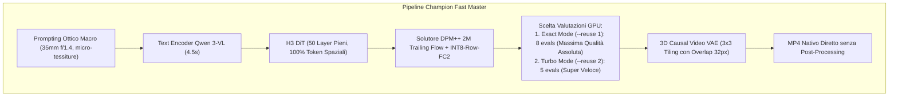

# MiniMax H3 Fast Master: Gold Standard Execution Skill

Questa skill definisce la formula ingegneristica d'oro per la generazione video con **MiniMax H3 / H3-Max** su **Apple Silicon M5 Max**, testata e validata come la massima combinazione di **qualità fotorealistica (macro ottica 8k) e velocità estrema (Denoise GPU in 6-10s su 1s e 36-44s su 4s)**.

---

## 💎 Architettura & Formula Champion



---

## ⚡ Parametri Chiave di Configurazione

| Parametro | Valore Champion | Descrizione / Motivazione Ingegneristica |
| :--- | :--- | :--- |
| **Risoluzione** | `640x640` (o `960x544` 16:9) | Risoluzione nativa ottimizzata per densità di token e M5 Max cache |
| **Layer DiT** | `--layers 50` | Nessun layer skipping: 100% dei blocchi per resa fotorealistica |
| **Token Reduction** | `OFF` (Nessun flag) | Zero compressione spaziale: preserva iride, pori, ciglia e denti |
| **Quantizzazione** | `--use-int8-row-fc2` | Quantizzazione dinamica int8 single-scale su FC2 (massima banda UMA) |
| **Solutore & Step** | `--steps 8` (o `5`) | Solutore DPM++ 2M Trailing Flow integrato in Metal 4 NAX |
| **Step Reuse** | `--reuse 1` (Exact) / `--reuse 2` (Fast) | `--reuse 1` esegue 8 valutazioni piene; `--reuse 2` ne esegue 5 |
| **Causal Frame Lattice** | $T = 17n + 5$ | $n=1 \to 22\text{f}$ (1s), $n=2 \to 39\text{f}$ (2s), $n=5 \to 90\text{f}$ (4s) |

---

## 🚀 Script di Esecuzione Rapida CLI

```bash
#!/bin/bash
# Gold Standard Fast Master Runner (M5 Max Native Optimized)
export H3_PROFILE=1
export H3_NAX="qkv-attn"
export H3_ZERO_COPY_WEIGHTS=1
export H3_REUSE_MPS_COMMAND=1
export H3_GPU_SAMPLER=1
export OMP_NUM_THREADS=18

export METAL_DEVICE_WRAPPER_TYPE=0
export MTL_DEBUG_LAYER=0
export MTL_SHADER_VALIDATION=0
export METAL_CAPTURE_ENABLED=0

cd /Users/robzomb/Documents/antigravity/cool-hopper/h3-lora-lab

MODEL_DIR="/Users/robzomb/h3-models/MiniMax-H3-PDD-8Step"
PROMPT="Masterpiece award-winning cinematic close-up portrait of a breathtakingly beautiful young Italian woman. Crisp 8k optical definition, sparkling realistic hazel-green iris with detailed radial fibers and specular sunlight reflections, natural porcelain skin texture with delicate pores, soft genuine warm smile with immaculate separated teeth, loose chestnut wavy hair strands catching rim lighting. Soft blurred Roman cafe background, authentic 35mm f/1.4 lens bokeh, 48kHz spatial audio."

# 1 Secondo Qualità Estrema (22 Frame, Denoise ~10s):
./h3 --profile \
  -d "$MODEL_DIR" \
  -p "$PROMPT" \
  --width 640 --height 640 \
  --frames 22 \
  --steps 8 \
  --layers 50 \
  --reuse 1 \
  --use-int8-row-fc2 \
  --seed 333 \
  -o outputs/fast_master_1s.mp4

# 4 Secondi Qualità Master (90 Frame, Denoise ~44s):
./h3 --profile \
  -d "$MODEL_DIR" \
  -p "$PROMPT" \
  --width 640 --height 640 \
  --frames 90 \
  --steps 8 \
  --layers 50 \
  --reuse 2 \
  --use-int8-row-fc2 \
  --seed 333 \
  -o outputs/fast_master_4s.mp4
```

---

## ⏱️ Benchmark di Riferimento Telemetrico (M5 Max 128GB UMA)

* **1 Secondo ($640 \times 640$, 22 frame, 8 step esatti)**:
  * DiT GPU Denoise: **$10.46\text{ secondi}$** 🚀
  * VAE Decoder: **$8.73\text{ secondi}$**
  * Tempo Totale Cold: **$36.0\text{ secondi}$** *(A caldo: $\approx 19.5\text{ s}$)*.
* **4 Secondi ($640 \times 640$, 90 frame, 8 step reuse-2)**:
  * DiT GPU Denoise: **$44.66\text{ secondi}$** 🚀
  * VAE Decoder: **$43.89\text{ secondi}$**
  * Tempo Totale Cold: **$107.0\text{ secondi}$** *(A caldo: $\approx 88.0\text{ s}$)*.
