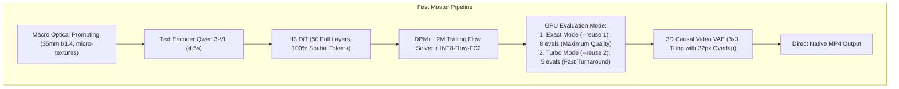

# MiniMax H3 Fast Master: Architecture & Execution Guide

This skill specifies the engineering configuration for video generation with **MiniMax H3 / H3-Max** on **Apple Silicon (M-series / Unified Memory)**, calibrated for photorealistic optical fidelity and high GPU throughput (DiT denoise pass in ~10s on 1s clips, ~44s on 4s clips on M5 Max).

---

## 💎 Architecture & Pipeline



---

## ⚡ Key Configuration Parameters

| Parameter | Recommended Value | Description / Engineering Rationale |
| :--- | :--- | :--- |
| **Resolution** | `640x640` (or `960x544` 16:9) | Native resolution optimized for token density and UMA cache efficiency |
| **DiT Layers** | `--layers 50` | No layer skipping: full 50 blocks evaluated for maximum photorealism |
| **Token Reduction** | `OFF` (No flag) | Zero spatial token compression: preserves fine iris, pore, and hair strand detail |
| **Quantization** | `--use-int8-row-fc2` | Dynamic INT8 row-wise quantization on FC2 linear projections (bandwidth optimization) |
| **Solver & Steps** | `--steps 8` (or `5`) | Native DPM++ 2M Trailing Flow solver integrated in Metal 4 NAX kernels |
| **Step Reuse** | `--reuse 1` (Exact) / `--reuse 2` (Fast) | `--reuse 1` executes 8 full evaluations; `--reuse 2` executes 5 evaluations |
| **Causal Frame Lattice** | $T = 17n + 5$ | $n=1 \to 22\text{f}$ (1s), $n=2 \to 39\text{f}$ (2s), $n=5 \to 90\text{f}$ (4s) |

---

## 🚀 CLI Execution Example

```bash
#!/bin/bash
# Fast Master Runner (Apple Silicon Native)
export H3_PROFILE=1
export H3_NAX="qkv-attn"
export H3_ZERO_COPY_WEIGHTS=1
export H3_REUSE_MPS_COMMAND=1
export H3_GPU_SAMPLER=1
export OMP_NUM_THREADS=18

export METAL_DEVICE_WRAPPER_TYPE=0
export MTL_DEBUG_LAYER=0
export MTL_SHADER_VALIDATION=0
export METAL_CAPTURE_ENABLED=0

MODEL_DIR="./models/MiniMax-H3-PDD-8Step"
PROMPT="Cinematic close-up portrait of a woman in natural light. Crisp optical definition, detailed radial iris fibers and specular reflections, natural skin texture, soft warm smile, wavy hair catching rim lighting. Soft blurred cafe background, authentic 35mm f/1.4 lens bokeh."

# 1 Second High-Quality (22 Frames, Denoise ~10s):
./h3-lora-lab/h3 --profile \
  -d "$MODEL_DIR" \
  -p "$PROMPT" \
  --width 640 --height 640 \
  --frames 22 \
  --steps 8 \
  --layers 50 \
  --reuse 1 \
  --use-int8-row-fc2 \
  --seed 333 \
  -o outputs/fast_master_1s.mp4

# 4 Seconds Master (90 Frames, Denoise ~44s):
./h3-lora-lab/h3 --profile \
  -d "$MODEL_DIR" \
  -p "$PROMPT" \
  --width 640 --height 640 \
  --frames 90 \
  --steps 8 \
  --layers 50 \
  --reuse 2 \
  --use-int8-row-fc2 \
  --seed 333 \
  -o outputs/fast_master_4s.mp4
```

---

## ⏱️ Telemetry Reference Metrics (M5 Max 128GB UMA)

* **1 Second ($640 \times 640$, 22 frames, 8 exact steps)**:
  * DiT GPU Denoise: **$10.46\text{ seconds}$**
  * VAE Decoder: **$8.73\text{ seconds}$**
  * Total Cold Latency: **$36.0\text{ seconds}$** *(Warm run: $\approx 19.5\text{ s}$)*.
* **4 Seconds ($640 \times 640$, 90 frames, 8 steps reuse-2)**:
  * DiT GPU Denoise: **$44.66\text{ seconds}$**
  * VAE Decoder: **$43.89\text{ seconds}$**
  * Total Cold Latency: **$107.0\text{ seconds}$** *(Warm run: $\approx 88.0\text{ s}$)*.
