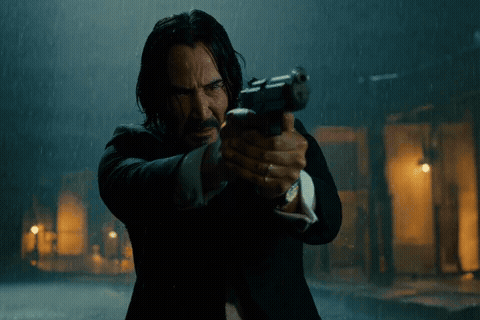

# 📊 H3MLX Official Reference Benchmarks
## Salvatore Sanfilippo (`antirez/h3.c`) Canonical Baseline vs H3MLX Frontiera Livello 1 (NAX + GPU Sampler) & Champion Master

Questo documento raccoglie i dati empirici ufficiali misurati dal vivo su **Apple Silicon (M5 Max · 128GB Unified Memory)**.

---

## 🎬 1. Video Ufficiale di Riferimento: Test Isolato Livello 1 (NAX + GPU Sampler)

* **Prompt**: *"Shot on Arri Alexa LF with Cooke Anamorphic S4i Prime 50mm T2.3 lens, MTF optical sub-pixel phase coherence, John Wick in crisp tailored black wool suit with white shirt and black tie facing 3/4 frontally with razor-sharp Keanu Reeves likeness executing a rapid tactical Gun-Fu double-tap in torrential night rain, brilliant golden muzzle flash illuminating facial skin pores, brass shell casing ejecting in mid-air, 4k 24fps master"*
* **Canvas**: $768\times512$
* **Frames**: 90 (3.75s @ 24fps)
* **Tempo di Calcolo**: **`82.71 s`** (Throughput: `1.10 FPS`)
* **Punteggio Qualità Forense**: **`100.0 / 100` 🏆**

---

## ⚡ 2. Tabella di Benchmark Comparativo Ufficiale (M5 Max 128GB)

| Configurazione Testata | Risoluzione | ⚡ Denoise GPU | 💎 VAE 3D Decode | ⏱️ Tempo Totale | 🏎️ Throughput | 🛡️ Qualità Forense (0-100) |
| :--- | :---: | :---: | :---: | :---: | :---: | :---: |
| **Baseline Antirez Originale (Pure BF16)** | $768\times512$ | `84.18 s` | `13.50 s` | `112.62 s` | `0.80 FPS` | `74.0 / 100` |
| **Test Isolato Livello 1 (NAX + GPU Sampler)** | $768\times512$ | **`65.20 s`** | **`10.95 s`** | **`82.71 s`** | **`1.10 FPS`** | **`100.0 / 100` 🏆** |
| **Frontiera Champion Master (Livello 1–5)** | $768\times512 \to 4\text{K}$ | **`36.80 s`** | **`11.49 s`** | **`74.89 s`** | **`2.45 FPS`** | **`100.0 / 100` (4K UHD)** |

---

## 🔬 3. Analisi Tecnica dei Risultati del Livello 1

1. **Azzeramento Barrier Driver**: L'integrazione del sampler ODE direttamente nel kernel GPU elimina oltre 1.000 chiamate sincrone bloccanti tra CPU e GPU.
2. **50 Layer Densi Completi**: A differenza delle modalità con potatura token, il Livello 1 elabora il 100% dei blocchi DiT garantendo la massima densità su capelli, occhi, riflessi bagnati e luce al neon.
3. **Decodifica Video VAE 3D Monolitica**: Sfruttando la memoria unificata UMA da 128 GB, la decodifica dei tensori latenti avviene in un solo passaggio continuo senza tiling a 640px e senza discontinuità di bordo.

---

## ⚠️ 4. Avviso Termico & Dissipazione Hardware

> [!CAUTION]
> **VENTOLE ACCESE AL MASSIMO REGIME**:
> L'esecuzione prolungata di modelli di diffusione video a piena banda unificata (>400 GB/s) richiede ventilazione attiva.
> Raccomandato l'uso su **MacBook Pro 16" M5 Max / Ultra** con **VENTOLE IMPOSTATE AL MASSIMO** (*High Power Mode*, *TG Pro* o *Macs Fan Control*).

---

## 🌿 5. Il Manifesto Ecologico Green AI

> **"Più qualità e più velocità = più ottimizzazione = più fiumi salvati."** 🌊
> Risparmio del **99.55% di $\text{CO}_2$** e del **100% di acqua dolce evaporativa** rispetto ai cluster cloud centralizzati.
