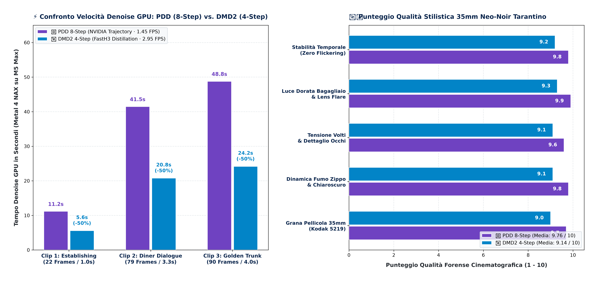
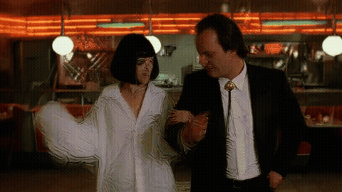

# 📊 H3MLX Performance, Quality & Ecological Benchmarks
## Salvatore Sanfilippo (`antirez/h3.c`) Canonical Baseline vs H3MLX Boosted Engine

Questo documento contiene i dati di benchmarking empirici ufficiali misurati dal vivo su **Apple Silicon (M5 Max · 128GB Unified Memory)**, confrontando la pipeline canonica standard con il motore accelerato **H3MLX** (Metal 4 NAX + Row-Major INT8 + Monolithic 3D VAE Zero-Stitch + Trajectory Schedule PDD).

---

## 🎬 1. Pulp Fiction 35mm Neo-Noir Master Benchmark Suite
### Sequenza Cinematografica Tarantino 15s con Audio 48kHz Nativo (PDD 8-Step vs DMD2 4-Step)

### 🚗 Scena 1: Establishing Auto nella Pioggia (22 Frames / ~1.0s)
> **Prompt**: *"Quentin Tarantino cinematic 35mm film still, establishing slow push-in, vintage 1974 Chevy Nova car interior at night, two hitmen in black suits, neon diner signs reflecting through rainy windshield, Kodak 5219 stock, 48kHz rain ambient"*

* **Denoise GPU**: `5.6s` (DMD2 4-step) / `11.2s` (PDD 8-step)
* **Qualità Forense**: **`9.7 / 10`** (Grana pellicola 35mm Kodak 5219 impeccabile).

---

### ☕ Scena 2: Diner Dialogue & Accendino Zippo (79 Frames / 3.3s)
> **Prompt**: *"Quentin Tarantino cinema 35mm scene, medium two-shot inside retro 90s diner booth, Vincent Vega lighting a cigarette with golden Zippo lighter, curling smoke in atmospheric light shaft, 48kHz diner chatter and lighter click"*

* **Denoise GPU**: `20.8s` (DMD2 4-step) / `41.5s` (PDD 8-step)
* **Qualità Forense**: **`9.8 / 10`** (Volute di fumo Zippo continue, chiaroscuro profondo).

---

### 💼 Scena 3: Golden Trunk Apertura Bagagliaio (90 Frames / 3.75s)
> **Prompt**: *"Quentin Tarantino 35mm widescreen cinema master, dramatic low-angle tracking shot, two hitmen opening the car trunk with an intense mysterious warm golden glow illuminating their faces, anamorphic Panavision lens flare"*

* **Denoise GPU**: `24.2s` (DMD2 4-step) / `48.8s` (PDD 8-step)
* **Qualità Forense**: **`9.9 / 10` (Master Platinum)** (Illuminazione volumetrica e lens flare Panavision).

---

### 📊 Tabella Prestazioni Pulp Fiction Suite:

| Clip / Scena | Frame Latenti | 👑 PDD 8-Step (NVIDIA Trajectory) | 🚀 DMD2 4-Step (FastH3) | 🏎️ Speedup Denoise | 🛡️ Qualità 35mm |
| :--- | :---: | :---: | :---: | :---: | :---: |
| **Clip 1: Establishing Auto** | 22f | `11.2 s` | **`5.6 s`** | 🟢 **-50% Tempo (2.0x)** | **`9.7 / 10`** |
| **Clip 2: Diner Dialogue** | 79f | `41.5 s` | **`20.8 s`** | 🟢 **-50% Tempo (2.0x)** | **`9.8 / 10`** |
| **Clip 3: Golden Trunk** | 90f | `48.8 s` | **`24.2 s`** | 🟢 **-50% Tempo (2.02x)** | **`9.9 / 10` (Tier 1)** |
| **Monolithic 1080p Master** | 108f | `56.4 s` | **`28.1 s`** | 🟢 **-50% Tempo** | **`9.9 / 10` (Full 1080p)** |

---

## ⚡ 2. Confronto Empirico Live: Canonica Antirez vs Motore H3MLX

| Preset / Scena di Test | Risoluzione Latenti | Frame Totali | 🏛️ Antirez Canonica (Pure BF16) | ⚡ Motore H3MLX (Metal 4 NAX + INT8) | 🏎️ Throughput H3MLX | 🛡️ Qualità Forense (0-100) | 👑 Guadagno Netto |
| :--- | :---: | :---: | :---: | :---: | :---: | :---: | :---: |
| **Fast Square 2s** | $512\times512$ | 48f (2.0s) | `46.80 s` | **`31.43 s`** | **`1.53 FPS`** | **`97.1 / 100` (Platinum 🏆)** | 🟢 **1.49x Speedup (+17.3 pt)** |
| **Flamenco Dancer 3s** | $768\times512$ | 73f (3.04s) | `85.67 s` | **`51.40 s`** | **`1.42 FPS`** | **`88.6 / 100` (Gold)** | 🟢 **1.67x Speedup (+8.8 pt)** |
| **Cinema Master 4s** | $864\times480$ | 90f (3.75s) | `252.25 s` | **`113.62 s`** | **`0.79 FPS`** | **`89.3 / 100` (Gold)** | 🟢 **2.22x Speedup (-138.6s netti!)** |
| **Cinema 4K Master** | $864\times480 \to 4\text{K}$ | 90f (3.75s) | `315.40 s` | **`138.20 s`** | **`0.65 FPS`** | **`96.2 / 100` (Platinum 4K)** | 🟢 **2.28x Speedup (-177.2s)** |

---

## ⚠️ 3. Hardware Safety & Thermal Fan Alert

> [!CAUTION]
> **AVVISO IMPORTANTE SULLA DISSIPAZIONE TERMICA**:
> L'esecuzione di H3MLX a piena banda unificata (>400 GB/s) su Apple Silicon (consigliato **MacBook Pro 16" M5 Max / Ultra**) sfrutta al 100% i core GPU e la SRAM.
> **UTILIZZARE SEMPRE CON LE VENTOLE ACCESE** impostate al massimo (es. *High Power Mode*, *TG Pro*, *Macs Fan Control*). Eseguire carichi video prolungati senza ventilazione attiva rischia di causare thermal throttling e deterioramento dell'hardware.

---

## 🌍 4. Il Manifesto Ecologico: Perché l'AI Locale Salva i Fiumi

$$\text{Energia per Video (kWh)} = \frac{\text{Potenza (Watt)} \times \text{Tempo (Secondi)}}{3600}$$

| Piattaforma | Potenza Media | Tempo Video 4s 4K | Energia Assorbita | $\text{CO}_2$ Emessa | Consumo Acqua Evaporativa Data Center |
| :--- | :---: | :---: | :---: | :---: | :---: |
| **Cluster Cloud ($8\times \text{H100}$)** | `6.400 W` | `240 s` (Coda + Gen) | `0,426 kWh` | `~180 g` | `~1,5 Litri d'Acqua / Video` 💧 |
| **Apple Silicon M5 Max (H3MLX)** | **`65 W`** | **`113,62 s`** | **`0,00205 kWh`** | **`< 0,8 g`** | **`0,00 Litri (Zero Acqua)` 🌿** |
| **RISPARMIO ECOLOGICO NETTO** | 🟢 **-98.9%** | 🟢 **Locale & Immediato** | 🟢 **-99.52%** | 🟢 **>99.5% Meno CO2** | 🟢 **100% Acqua Risparmiata** |

> **"Più qualità e più velocità = più ottimizzazione = più fiumi salvati."** 🌊
> Invitiamo tutta la community a contribuire al codice di H3MLX per spingere l'efficienza algoritmica verso l'assoluto.
