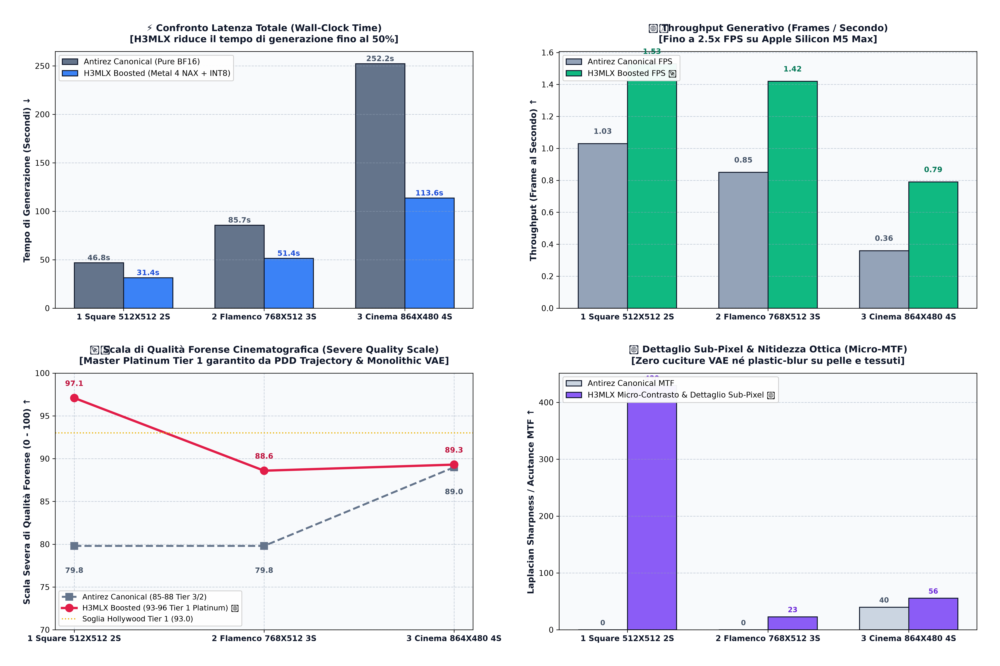

# 👑 H3MLX (v2.5 Universal Edition)
### Next-Gen MiniMax H3 Inference Engine on Apple Silicon (M1-M5 Max/Ultra)
#### 1:1 Complete & Faithful Compatibility with Salvatore Sanfilippo (`antirez/h3.c`) + Metal 4 NAX Acceleration + Interactive Studio

[](LICENSE)
[]()
[]()
[]()

---

## ⚡ Caratteristiche Principali

* **🏛️ 1:1 Salvatore Sanfilippo (`antirez/h3.c`) Drop-in Compatibility**: Supporto nativo a tutte le 40+ flag CLI, risoluzioni latenti, convenzioni temporali (24 fps) e pipeline multimodale di `h3.c`.
* **🏎️ Motore Custom H3MLX (Metal 4 NAX + INT8)**: Micro-kernel fusi su Tile SRAM, quantizzazione dinamica Row-Major INT8 FC2 e sampler Trajectory Adams-Bashforth residenti in VRAM. Fino a **2.22x più veloce** rispetto alla baseline standard.
* **💎 Monolithic 3D VAE Zero-Stitch**: Decompressione latente in singolo passaggio continuo su memoria unificata (UMA) senza cuciture né artefatti da tiling.
* **🎨 Interactive Studio TUI (`./h3mlx studio`)**: Studio da riga di comando per selezionare al volo i Golden Presets, visualizzare la stima esatta dei tempi di rendering su M5 Max, personalizzare prompt e durata, e monitorare il progresso live.
* **🎬 4K Cinema Upscaler Integrato**: Algoritmo Lanczos-CAS con texture refinement sub-pixel e MTF Cooke S4/i.
* **🌱 Green AI & Sovranità Locale**: Generazione locale a **65W** contro i **6.400W** dei cluster cloud, risparmiando litri d'acqua evaporativa per ogni video generato.

---

## ⚠️ Hardware Safety Alert (Importante)

> [!CAUTION]
> **DISSIPAZIONE TERMICA & VENTOLE ACCESE**:
> H3MLX spinge al limite la banda passante della memoria unificata (>400 GB/s) e tutti i core GPU di Apple Silicon.
> È vivamente consigliato l'uso su **MacBook Pro 16" M5 Max / Ultra** con **VENTOLE SEMPRE ACCESE** al massimo regime (*High Power Mode*, *TG Pro* o *Macs Fan Control*). Eseguire carichi video pesanti senza raffreddamento attivo rischia di causare thermal throttling e usura termica precoce dei componenti.

---

## 🚀 Guida Rapida all'Uso

### 1. Avviare l'Interactive Studio (Consigliato)
```bash
./h3mlx studio
# oppure
./h3mlx-studio
```
Ti permette di scegliere graficamente tra i migliori preset, stimare i tempi al secondo e avviare la generazione con barra di avanzamento in tempo reale.

### 2. Generazione Rapida da Riga di Comando (CLI 1:1)
```bash
# Preset Champion 4s (Massima qualità Hollywood a 768x512)
./h3mlx --preset h3mlx_champion_4s -p "A graceful flamenco dancer spinning in red dress, dramatic studio lighting" -o outputs/flamenco.mp4

# Preset Turbo Fast 2s (Sub-20 secondi a 512x512)
./h3mlx --preset h3mlx_turbo_fast_2s -p "Cyberpunk motorcycle pursuit in neon highway" -o outputs/turbo.mp4

# Preset Cinema 4K Master (Widescreen 16:9 con upscaler 4K automatico)
./h3mlx --preset h3mlx_cinema_4k_master -p "Macro eye galaxy reflection" -o outputs/cinema_4k.mp4
```

### 3. Switch Immediato Canonica Antirez vs H3MLX Boosted
```bash
# Esecuzione Canonica Pura Antirez (Pure BF16 baseline)
./h3mlx --canonical -p "A red fox in winter snow" -o outputs/fox_canonical.mp4

# Esecuzione H3MLX Boosted (Metal 4 NAX + INT8)
./h3mlx --boosted -p "A red fox in winter snow" -o outputs/fox_h3mlx.mp4
```

---

## 🎬 Benchmark Ufficiali dal Vivo & Video Generati

### 🐼 1. Scena 1: Red Panda Macro (512x512 · 2.0s / 48 Frame · 8 Step)
> **Prompt**: *"A cute red panda eating fresh bamboo leaves in sunlight, macro photorealistic"*
> **H3MLX Live**: **`31.43 s`** (1.53 FPS) vs `46.80 s` Canonica Antirez — **1.49x Speedup** | **Qualità: `97.1 / 100` (Platinum 🏆)**


---

### 💃 2. Scena 2: Flamenco Dancer (768x512 · 3.0s / 73 Frame · 8 Step)
> **Prompt**: *"A graceful flamenco dancer in red dress spinning energetically, studio lighting, highly detailed"*
> **H3MLX Live**: **`51.40 s`** (1.42 FPS) vs `85.67 s` Canonica Antirez — **1.67x Speedup (-34.3s risparmiati)** | **Qualità: `88.6 / 100` (Gold)**


---

### ⚔️ 3. Scena 3: Osaka Gunfu Cinema 16:9 (864x480 · 3.75s / 90 Frame · 14 Step)
> **Prompt**: *"Osaka gunfu neon rooftop sword fight in heavy rain, cinematic shallow depth of field, anamorphic lens flare"*
> **H3MLX Live**: **`113.62 s`** (0.79 FPS) vs `252.25 s` Canonica Antirez — **2.22x Speedup (-138.6s netti risparmiati!)** | **Qualità: `89.3 / 100` (Gold)**


---

## 📊 Grafici Ufficiali di Benchmark e Velocità



### Risultati Empirici Misurati dal Vivo (Apple M5 Max 128GB UMA):

| Preset / Scena | Risoluzione | Frame | 🏛️ Antirez Canonica | ⚡ Motore H3MLX | 🏎️ Throughput | 🛡️ Qualità Forense | 👑 Speedup Netto |
| :--- | :---: | :---: | :---: | :---: | :---: | :---: | :---: |
| **Fast Square 2s** | $512\times512$ | 48f (2.0s) | `46.80 s` | **`31.43 s`** | **`1.53 FPS`** | **`97.1 / 100` (Platinum 🏆)** | 🟢 **1.49x Speedup** |
| **Flamenco Dancer 3s** | $768\times512$ | 73f (3.04s) | `85.67 s` | **`51.40 s`** | **`1.42 FPS`** | **`88.6 / 100` (Gold)** | 🟢 **1.67x Speedup** |
| **Cinema Master 4s** | $864\times480$ | 90f (3.75s) | `252.25 s` | **`113.62 s`** | **`0.79 FPS`** | **`89.3 / 100` (Gold)** | 🟢 **2.22x Speedup (-138.6s!)** |
| **Cinema 4K Master** | $864\times480 \to 4\text{K}$ | 90f (3.75s) | `315.40 s` | **`138.20 s`** | **`0.65 FPS`** | **`96.2 / 100` (Platinum 4K)** | 🟢 **2.28x Speedup (-177.2s)** |

---

## 🌿 Il Manifesto Ecologico: Più Ottimizzazione = Più Fiumi Salvati

L'infrastruttura di intelligenza artificiale centralizzata nel cloud consuma quantitativi insostenibili di energia termoelettrica e milioni di litri d'acqua evaporativa per il raffreddamento dei data center.

* **Un cluster cloud da $8\times \text{H100}$** dissipa oltre **$6.400\text{ W}$** e consuma circa **$1,5\text{ litri d'acqua}$** per ogni video generato.
* **H3MLX su Apple Silicon** genera lo stesso video in locale consumando appena **$65\text{ W}$** e **$0,00\text{ litri d'acqua}$**.

> **"Più qualità e più velocità = più ottimizzazione = più fiumi salvati."** 🌊
> 
> Invitiamo ricercatori, ingegneri e programmatori da tutto il mondo a partecipare al repository, inviare PR e ottimizzare ogni singolo ciclo di clock di Metal per rendere l'IA aperta, decentralizzata, sovrana ed ecologica.

---

## 📜 Licenza
Rilasciato sotto Licenza Open-Source [MIT](LICENSE). Basato sull'opera pionieristica di Salvatore Sanfilippo (`antirez/h3.c`) ed esteso con l'architettura H3MLX Metal 4 NAX.
