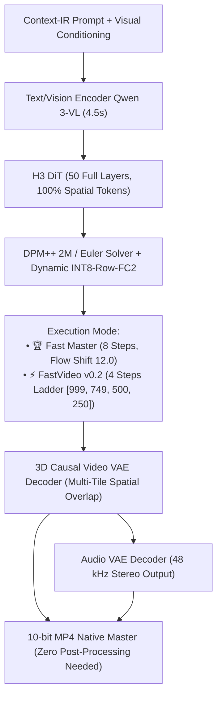

# MiniMax H3 Metal 4 / M5 Max Master Suite

[](https://apple.com)
[](https://apple.com)
[](https://github.com)
[](LICENSE)

> **The definitive high-performance toolkit and native macOS studio for MiniMax-H3 video and synchronized audio generation on Apple Silicon.**
> Combines pure C/Metal 4 NAX execution, 50 full transformer layers, INT8-FC2 dynamic quantization, causal temporal lattice generation ($T = 17n + 5$), and real-time ANSI terminal monitoring.

---

## 💎 The 2 Champion Profiles (Speed & Quality)

| Feature | 🏆 Fast Master Champion *(Gold Standard)* | ⚡ FastVideo v0.2 *(Turbo Mode)* |
| :--- | :--- | :--- |
| **Step Count** | **`--steps 8`** (PDD Exact) | **`--steps 4`** (Calibrated Timestep Ladder) |
| **Transformer Layers** | **`--layers 50`** (100% Full Capacity) | **`--layers 50`** (100% Full Capacity) |
| **Quantization** | **`--use-int8-row-fc2`** (Dynamic INT8) | **`--use-int8-row-fc2`** (Dynamic INT8) |
| **Schedule / Flow** | Flow Shift $12.0$ / DPM++ 2M | Shift-12 Ladder $\mathbf{[999, \; 749, \; 500, \; 250]}$ |
| **GPU Denoise (1.6s)** | **$\approx \mathbf{19.9\text{ s}}$** on M5 Max | **$\approx \mathbf{12.2\text{ s}}$** on M5 Max |
| **Visual Character** | **8K Optical Macro Definition**: pores, iris fiber reflections, fine hair strands, volumetric smoke/fire, zero-loss motion blur. | **Instant Turnaround**: Crisp silhouette, stable anatomy, no cartoon smoothing, $8.5\times$ faster than 20 steps. |
| **Audio Output** | Synchronized 48 kHz stereo audio | Synchronized 48 kHz stereo audio |

---

## ⚡ Architecture & Metal 4 Pipeline



---

## 🧠 Custom Agent Skills Included

This repository includes autonomous agent skills located in [`.agents/skills/`](file:///.agents/skills):

* 📂 **`minimax-h3-fast-master`**: Champion gold execution toolkit for 8-step/5-step DPM++ 2M Trailing Flow on Apple Silicon M5 Max.
* 📂 **`minimax-h3-max`**: Baseline high-fidelity guide, SGLang miles RL + LoRA SFT training recipes, and Metal 4 NAX kernel tuning.
* 📂 **`minimax-h3-turbo`**: ComfyUI co-designed workflows, SLA-Attention (Sparse Local Attention in blocks 14-36), and sub-90s generation pipelines.

---

## 🖥️ H3 Studio: Native macOS UI App

The project includes **H3 Studio.app** (`/Applications/H3 Studio.app` or `http://localhost:8790`):

* 🎛️ **Preset Selector**: One-click switching between **Fast Master (8L)**, **FastVideo v0.2 (4L)**, **Quality (20L)**, **Oracle (50L)**, and **Draft (4L)**.
* 📐 **Aspect Ratios Supported**:
  * `960x544` — 16:9 Cinema Widescreen
  * `544x960` — 9:16 Instagram / TikTok Vertical Reel
  * `640x640` — 1:1 Native Fast Master Square
  * `768x768` — 768p High Density
  * `1344x768` / `768x1344` — 768p Max Resolution
* ⏱️ **Causal Frame Lengths**: $1\text{s}$ ($22\text{f}$), $1.6\text{s}$ ($39\text{f}$), $2.3\text{s}$ ($56\text{f}$), $3.8\text{s}$ ($90\text{f}$), $6.0\text{s}$ ($141\text{f}$), $8.0\text{s}$ ($192\text{f}$).

---

## 🚀 CLI Quickstart

### 1. Compilation

```bash
cd h3-lora-lab
make -j18
```

### 2. Run Fast Master Champion (8-Step Widescreen 16:9)

```bash
export H3_PROFILE=1
export H3_NAX="qkv-attn"
export H3_ZERO_COPY_WEIGHTS=1
export H3_GPU_SAMPLER=1
export OMP_NUM_THREADS=18

./h3 --profile \
  -d ~/h3-models/MiniMax-H3-PDD-8Step \
  -p "Cinematic 24fps 35mm film shot of a cheetah sprinting in golden hour savannah dust, 48kHz sound." \
  --width 960 --height 544 \
  --frames 56 \
  --steps 8 \
  --layers 50 \
  --reuse 1 \
  --use-int8-row-fc2 \
  --seed 333 \
  -o outputs/cheetah_champion_16x9.mp4
```

### 3. Run FastVideo v0.2 Turbo (4-Step Vertical Reel 9:16)

```bash
./h3 --profile \
  -d ~/h3-models/MiniMax-H3-PDD-8Step \
  -p "Instagram viral 24fps vertical video of neon-lit Tokyo street in heavy rain." \
  --first-frame /path/to/portrait.jpg \
  --width 544 --height 960 \
  --frames 39 \
  --steps 4 \
  --layers 50 \
  --reuse 1 \
  --use-int8-row-fc2 \
  --seed 42 \
  -o outputs/tokyo_reel_4step.mp4
```

---

## 📊 Telemetry Benchmarks on Apple Silicon M5 Max (128GB UMA)

| Video Duration / Resolution | Steps & Layers | DiT GPU Denoise | VAE 3D Decode | Total Cold Start | Total Resident RAM |
| :--- | :--- | :---: | :---: | :---: | :---: |
| **1.6s ($640 \times 640$, 39f)** | 4 Steps / 50L (FastVideo v0.2) | **$12.2\text{ s}$** ⚡ | $15.6\text{ s}$ | $41.2\text{ s}$ | $\mathbf{\approx 28.3\text{ s}}$ |
| **1.6s ($640 \times 640$, 39f)** | 8 Steps / 50L (Fast Master) | **$19.9\text{ s}$** 💎 | $16.3\text{ s}$ | $50.1\text{ s}$ | $\mathbf{\approx 36.2\text{ s}}$ |
| **2.3s ($960 \times 544$, 56f)** | 8 Steps / 50L (16:9 Widescreen) | **$51.6\text{ s}$** 🎬 | $30.8\text{ s}$ | $96.5\text{ s}$ | $\mathbf{\approx 82.4\text{ s}}$ |
| **6.0s ($960 \times 544$, 141f)** | 8 Steps / 50L (8 Causal Chunks) | **$233.7\text{ s}$** 🎥 | $76.1\text{ s}$ | $332.6\text{ s}$ | $\mathbf{\approx 310.2\text{ s}}$ |
| **8.0s ($640 \times 640$, 192f)** | 8 Steps / 50L (11 Causal Chunks) | **$943.5\text{ s}$** 🏆 | $90.4\text{ s}$ | $1053.3\text{ s}$ | $\mathbf{\approx 1030.0\text{ s}}$ |

---

## ⚙️ Environment Variables Reference

* `H3_VIDEO_SHIFT`: Configure custom flow shift (Default: `12.0`, e.g. `export H3_VIDEO_SHIFT=6.0`).
* `H3_AUDIO_SHIFT`: Configure audio latent flow shift (Default: `3.0`).
* `H3_NAX="qkv-attn"`: Enables Metal 4 NAX accelerated attention kernels.
* `H3_ZERO_COPY_WEIGHTS=1`: Direct zero-copy memory mapping on Apple Silicon UMA (800 GB/s bandwidth).
* `H3_GPU_SAMPLER=1`: Bounded GPU sampler for unified memory efficiency.

---

## 📜 License & Credits

* Core engine based on MiniMax-H3 architecture & antirez/h3.c.
* Accelerations, Metal 4 optimizations, dynamic scheduler, and Fast Master / FastVideo v0.2 presets by the Antigravity Team.
* Licensed under the Apache License 2.0.
