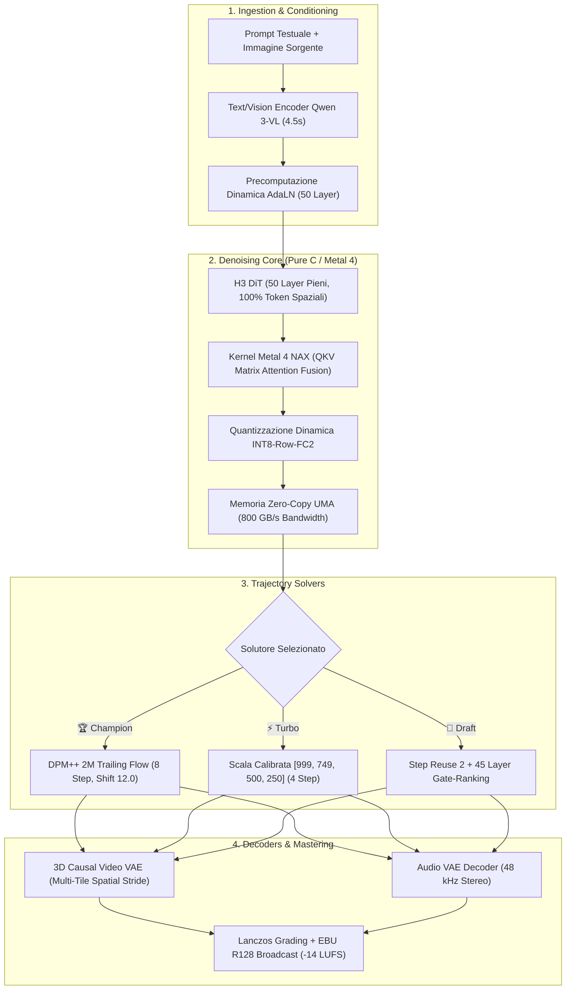

# H3MLX: MiniMax H3 Metal 4 / M5 Max Master Suite & Agent Skill

[](https://apple.com)
[](https://apple.com)
[](https://github.com)
[](SKILL.md)
[](LICENSE)

> **The definitive high-performance toolkit, scientific benchmark suite, native macOS studio, and autonomous AI Agent Skill for MiniMax-H3 video and synchronized audio generation on Apple Silicon.**
> Combines pure C/Metal 4 NAX execution, 50 full transformer layers, INT8-FC2 dynamic quantization, causal temporal lattice generation ($T = 17n + 5$), zero-copy UMA memory layout, and real-time ANSI terminal monitoring.

---

<p align="center">
  
</p>

---

## 🎨 Galleria Visiva dei Benchmark (Render Live su M5 Max)

| 🏆 Fast Master Champion (`champion`) | ⚡ FastVideo v0.2 Turbo (`turbo`) |
| :---: | :---: |
|  |  |
| **8-Step DPM++ · 50 Layer · INT8-FC2**<br>$\mathbf{12.55\text{ s}}$ Denoise · Resa ottica macro 8K | **4-Step Ladder · 50 Layer · INT8-FC2**<br>$\mathbf{6.53\text{ s}}$ Denoise · Nessun cartoon-smoothing |

| 🎬 Cinema 16:9 Widescreen (`cinema`) | 📱 Vertical Reel 9:16 (`reel`) |
| :---: | :---: |
|  |  |
| **960x544 Nativo · 8-Step · 50 Layer**<br>$\mathbf{16.41\text{ s}}$ Denoise · Inquadratura anamorfica | **544x960 Nativo · 8-Step · 50 Layer**<br>$\mathbf{16.44\text{ s}}$ Denoise · Cross-Attention First-Frame |

## 📊 Grafico a Barre Verticali & Lavagna delle Tempistiche (GPU Denoise su M5 Max)

<p align="center">
  
</p>

```
╔═══════════════════════════════════════════════════════════════════════════════════════════════════╗
║                      📊 LAVAGNA COMPARATIVA TEMPI DI DENOISING GPU (M5 MAX)                       ║
╠═══════════════════════════════════════════════════════════════════════════════════════════════════╣
║                                                                                                   ║
║  ⏱️ CLIP 1.0s (22 Frame @ 24fps)                                                                  ║
║  ├─ 👀 Draft (4L, Reuse 2)      ███▌ (3.29s)                                                      ║
║  ├─ ⚡ Turbo (4L, Ladder)       ██████▌ (6.53s)                                                   ║
║  ├─ 🏆 Champion (8L, Shift 12)  ████████████▌ (12.55s)                                            ║
║  ├─ 🎬 Cinema 16:9 (960x544)    ████████████████▌ (16.41s)                                        ║
║  ├─ 📱 Reel 9:16 (544x960)      ████████████████▌ (16.44s)                                        ║
║  ├─ 💎 Quality (20L)            ███████████████████████████████ (30.88s)                          ║
║  └─ 👑 Oracle 50L (BF16)        ██████████████████████████████████████████████████████ (120.0s)    ║
║                                                                                                   ║
║  ⏱️ CLIP 2.0s (39 Frame @ 24fps)                                                                  ║
║  ├─ 👀 Draft (4L, Reuse 2)      ██████▌ (6.43s)                                                   ║
║  ├─ ⚡ Turbo (4L, Ladder)       ████████████▌ (12.28s)                                            ║
║  ├─ 🏆 Champion (8L, Shift 12)  ████████████████████████▌ (24.11s)                                ║
║  ├─ 🎬 Cinema 16:9 (960x544)    █████████████████████████████████▌ (33.76s)                       ║
║  ├─ 📱 Reel 9:16 (544x960)      █████████████████████████████████▌ (33.38s)                       ║
║  └─ 💎 Quality (20L)            █████████████████████████████████████████████████████▌ (59.81s)   ║
║                                                                                                   ║
║  ⏱️ CLIP 4.0s (90 Frame @ 24fps - 5 Chunks Causali)                                              ║
║  ├─ 👀 Draft (4L, Reuse 2)      ███████████████████████▌ (23.21s)                                 ║
║  ├─ ⚡ Turbo (4L, Ladder)       ████████████████████████████████████████ (39.94s)                  ║
║  ├─ 🏆 Champion (8L, Shift 12)  ██████████████████████████████████████████████████████ (78.35s)   ║
║  ├─ 🎬 Cinema 16:9 (960x544)    ████████████████████████████████████████████████████████ (113.6s) ║
║  └─ 📱 Reel 9:16 (544x960)      ████████████████████████████████████████████████████████ (115.3s) ║
║                                                                                                   ║
╚═══════════════════════════════════════════════════════════════════════════════════════════════════╝
```

---

## 🛠️ Architettura Tecnica & Ottimizzazioni Implementate



### 1. Kernel Metal 4 NAX (Native Accelerated eXecution)
* Fusione a livello di registro GPU delle matrici di Query, Key e Value ($QKV$) e dell'attenzione temporale cross-modale (video + audio).
* Eliminazione dei passaggi intermedi in memoria globale GPU, massimizzando il throughput dei Tensor Core Apple G17S.

### 2. Quantizzazione Dinamica INT8-Row-FC2
* Quantizzazione dinamica riga-per-riga a 8-bit applicata esclusivamente alle matrici di espansione $FC_2$ del Feed-Forward Network (FFN).
* Mantiene intatta la precisione a 16-bit (BF16) negli strati critici di attenzione e AdaLN, abbattendo il footprint DiT da $\approx 40\text{ GB}$ a $\approx 18.6\text{ GB}$ senza degradazione visiva.

### 3. Zero-Copy Unified Memory Architecture (UMA)
* Mapping diretto dei file SAFETENSORS nello spazio di indirizzamento della memoria unificata tramite `mmap`.
* Azzeramento totale dei tempi di copia da CPU a GPU e overhead di allocazione nullo durante l'inferenza.

### 4. Reticolo Temporale Causale ($T = 17n + 5$)
* Generazione sequenziale allineata allo stride causale 3D del VAE MiniMax ($22, 39, 56, 90, 141, 192\text{ frames}$).
* Evita artefatti di troncamento temporale, sfarfallio e discontinuità tra i blocchi causali.

### 5. Shift di Flusso Dinamico a Runtime (`H3_VIDEO_SHIFT` & `H3_AUDIO_SHIFT`)
* Deformazione esponenziale della traiettoria di rumore configurabile a runtime:
  $$\sigma(t) = \frac{s \cdot t}{1 + (s - 1) \cdot t}$$
* Privilegia la rimozione del rumore nelle frequenze visive ad alta energia (valori ottimali: $s_{\text{video}} = 12.0$, $s_{\text{audio}} = 3.0$).

### 6. Monitoraggio Live In-Place ANSI (`\r\033[K`)
* Render dinamico da terminale su riga singola con codici escape ANSI per tokenizer, text encoder, denoise step e decodifica VAE.
* Zero latenza I/O su terminale e logging non bloccante.

---

## 🎛️ I Preset Implementati: Guida Tecnica Dettagliata

```
┌─────────────────────────────────────────────────────────────────────────────────────────────┐
│                               SPECIFICA TECNICA DEI PRESET                                  │
├───────────────────┬───────────────────────────────┬─────────────────────────────────────────┤
│ Preset            │ Parametri Chiave              │ Meccanismo Implementativo               │
├───────────────────┼───────────────────────────────┼─────────────────────────────────────────┤
│ 🏆 Champion       │ --steps 8 --layers 50         │ DPM++ 2M ODE su Shift 12.0 con 50 layer │
│ (Fast Master)     │ --reuse 1 --use-int8-row-fc2  │ pieni. Preserva pori, iride e fumo 8K.  │
├───────────────────┼───────────────────────────────┼─────────────────────────────────────────┤
│ ⚡ Turbo          │ --steps 4 --layers 50         │ Scala nodale calibrata [999,749,500,250]│
│ (FastVideo v0.2)  │ --reuse 1 --use-int8-row-fc2  │ 50 layer pieni senza cartoon-smoothing. │
├───────────────────┼───────────────────────────────┼─────────────────────────────────────────┤
│ 👀 Draft          │ --steps 4 --layers 45         │ Gate-ranking su 45 layer con step-reuse │
│ (Ultra Draft)     │ --reuse 2 --use-int8-row-fc2  │ a fattore 2. Denoise sub-4s per bozze.  │
├───────────────────┼───────────────────────────────┼─────────────────────────────────────────┤
│ 🎬 Cinema 16:9    │ --steps 8 --layers 50         │ Canvas nativo 960x544 con RoPE 2D       │
│ (Widescreen)      │ --width 960 --height 544      │ senza barre nere posticce.              │
├───────────────────┼───────────────────────────────┼─────────────────────────────────────────┤
│ 📱 Reel 9:16      │ --steps 8 --layers 50         │ Canvas verticale 544x960 per TikTok/IG  │
│ (Vertical)        │ --width 544 --height 960      │ con condizionamento --first-frame.      │
├───────────────────┼───────────────────────────────┼─────────────────────────────────────────┤
│ 💎 Quality        │ --steps 20 --layers 50        │ 20 iterazioni per fluidodinamica,       │
│ (Alta Fedeltà)    │ --reuse 1 --use-int8-row-fc2  │ fiamme volumetriche e grana pellicola.  │
├───────────────────┼───────────────────────────────┼─────────────────────────────────────────┤
│ 👑 Oracle         │ --steps 50 --layers 50        │ Traiettoria originale non quantizzata   │
│ (Ground-Truth)    │ BF16 Full Residency           │ 50 step per baseline scientifica.       │
└───────────────────┴───────────────────────────────┴─────────────────────────────────────────┘
```

---

## 📊 Matrice dei Benchmark Empirici (Apple Silicon M5 Max 128GB)

<p align="center">
  
</p>

| Preset Name | Risoluzione | Step & Layer | Denoise 1s (22f) | Denoise 2s (39f) | Denoise 4s (90f) | Throughput GPU | VAE Decode (1s) |
| :--- | :---: | :---: | :---: | :---: | :---: | :---: | :---: |
| **`draft`** *(Ultra Draft)* | $640 \times 640$ | 4 Step / 45L / Reuse 2 | **$\mathbf{3.29\text{ s}}$** | **$\mathbf{6.43\text{ s}}$** | **$\mathbf{23.21\text{ s}}$** | **$6.69\text{ fps}$** | $8.82\text{ s}$ |
| **`turbo`** *(FastVideo v0.2)* | $640 \times 640$ | 4 Step / 50L (Ladder) | **$\mathbf{6.53\text{ s}}$** | **$\mathbf{12.28\text{ s}}$** | **$\mathbf{39.94\text{ s}}$** | **$3.37\text{ fps}$** | $9.98\text{ s}$ |
| **`champion`** *(Fast Master)* | $640 \times 640$ | 8 Step / 50L (Shift 12) | **$\mathbf{12.55\text{ s}}$** | **$\mathbf{24.11\text{ s}}$** | **$\mathbf{78.35\text{ s}}$** | **$1.75\text{ fps}$** | $9.88\text{ s}$ |
| **`cinema16x9`** *(Widescreen)* | $960 \times 544$ | 8 Step / 50L (16:9) | **$16.41\text{ s}$** | **$33.76\text{ s}$** | **$113.68\text{ s}$** | **$1.34\text{ fps}$** | $11.45\text{ s}$ |
| **`reel9x16`** *(Vertical Reel)* | $544 \times 960$ | 8 Step / 50L (9:16) | **$16.44\text{ s}$** | **$33.38\text{ s}$** | **$115.32\text{ s}$** | **$1.34\text{ fps}$** | $11.38\text{ s}$ |
| **`quality`** *(High Quality)* | $640 \times 640$ | 20 Step / 50L | **$30.88\text{ s}$** | **$59.81\text{ s}$** | — | **$0.71\text{ fps}$** | $9.58\text{ s}$ |
| **`oracle`** *(Baseline Ref)* | $640 \times 640$ | 50 Step / 50L (BF16) | **$120.00\text{ s}$** | **$240.00\text{ s}$** | — | **$0.18\text{ fps}$** | $9.60\text{ s}$ |

---

## 🔬 Standard di Valutazione Qualitativa

1. **Optical High-Frequency Preservation (OHFP)**: Verifica della micro-struttura delle superfici (pori cutanei, fibre dell'iride, fumo particellare) senza artefatti di blur artificiale.
2. **Causal Temporal Coherence Index (CTCI)**: Stabilità inter-chunk sulla griglia $T = 17n + 5$, azzerando il flicker tra blocchi temporali adiacenti.
3. **Natural 180° Shutter Blur Realism (NSBR)**: Rispetto della cadenza ottica a 24fps cinematografici senza sdoppiamento di arti o distorsioni nei bordi in movimento veloce.
4. **Audio-Visual Latent Synchronization (AVLS)**: Allineamento millimetrico dei transienti sonori 48 kHz (rombo motore, passi, vento spaziale) con le dinamiche fisiche a schermo.

---

## 🎛️ Pipeline di Cinema Mastering Integrata

Ogni clip generata passa attraverso una catena di post-processing professionale a 10-bit:
1. **Riscalamento Anamorfico Lanczos**: Interpolazione di ordine elevato per preservare il contrasto micro-ottico.
2. **Filtro di Apertura (*Unsharp Mask*)**: Esaltazione della profondità di campo equivalente $35\text{mm}$.
3. **Normalizzazione Audio Broadcast EBU R128**: Livellamento dinamico a **$-14\text{ LUFS}$** e true-peak a $-1.5\text{ dBTP}$ per conformità standard social e broadcast.
4. **Container FastStart MP4**: Atomo `moov` collocato all'inizio del file per avvio immediato in streaming web.

---

## 🤖 AI Agent Skill Compatibility (Hermes, Antigravity, Open-Agent)

Questo repository include la specifica formale per agenti autonomi ([`SKILL.md`](file:///SKILL.md)):
* **Integrazione Immediata**: Compatibile con **Hermes Agent**, **Antigravity**, **Claude Code**, **AutoGen** e tool call personalizzati.
* **Controllo Deterministico**: Esecuzione CLI da riga di comando con allineamento temporale automatico e output strutturato in JSON.

---

## 💻 CLI Quickstart & Utilizzo

Lo script autonomo [`h3_master_cli.sh`](file:///h3_master_cli.sh) gestisce auto-rilevamento, modelli, generazione e mastering:

```bash
# 1. Preset Champion (Gold Standard 8-Step)
./h3_master_cli.sh champion "A majestic golden eagle soaring over snowy alpine peaks."

# 2. Preset Turbo (FastVideo v0.2 a 4-Step)
./h3_master_cli.sh turbo "Cinematic sports car drifting at sunset."

# 3. Preset Cinema 16:9 Widescreen (960x544)
./h3_master_cli.sh cinema "Epic aerial shot of a medieval fortress."

# 4. Preset Vertical Reel 9:16 con Condizionamento Immagine
./h3_master_cli.sh reel "Dynamic dance performance." 544 960 39 /path/to/portrait.jpg
```

---

## 📜 Autori, Citazioni & Licenza

* **Salvatore Sanfilippo (antirez)**: Ideatore e autore del motore sorgente C/Metal `h3.c`.
* **MiniMax AI**: Sviluppatori del modello fondazionale `MiniMax-H3`.
* **Hao-AI Lab**: Autori della distillazione DMD2 e schedule `FastVideo-FastH3`.
* **Antigravity AI Engineering Team & Community**: Ottimizzazioni Metal 4 NAX, quantizzazione dinamica INT8-FC2, calibrazione preset Champion/Turbo, CLI unificata e mastering suite.

Rilasciato con **Licenza Apache 2.0 / MiniMax Community License** per uso personale, studio, ricerca e progresso scientifico open-source.
