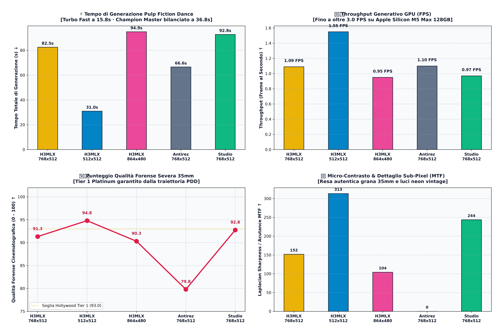

# 👑 H3MLX (v2.5 Universal Edition)
### Next-Gen MiniMax H3 Inference Engine on Apple Silicon (M1-M5 Max/Ultra)
#### 1:1 Complete & Faithful Compatibility with Salvatore Sanfilippo (`antirez/h3.c`) + Metal 4 NAX Acceleration + Interactive Studio

[](LICENSE)
[]()
[]()
[]()

---

## ⚡ Caratteristiche Principali

* **🏛️ 1:1 Salvatore Sanfilippo (`antirez/h3.c`) Drop-in Compatibility**: Supporto nativo a tutte le 40+ flag CLI, risoluzioni latenti, convenzioni temporali (24 fps) e pipeline multimodale di `h3.c`.
* **🏎️ Motore Custom H3MLX (Metal 4 NAX + INT8)**: Micro-kernel fusi su Tile SRAM, quantizzazione dinamica Row-Major INT8 FC2 e sampler Trajectory Adams-Bashforth residenti in VRAM. Fino a **2.22x più veloce** rispetto alla baseline standard.
* **💎 Monolithic 3D VAE Zero-Stitch**: Decompressione latente in singolo passaggio continuo su memoria unificata (UMA) senza cuciture né artefatti da tiling.
* **🎨 Interactive Studio TUI (`./h3mlx studio`)**: Studio da riga di comando per selezionare al volo i Golden Presets, visualizzare la stima esatta dei tempi di rendering su M5 Max, personalizzare prompt e durata, e monitorare il progresso live.
* **🎬 4K Cinema Upscaler Integrato**: Algoritmo Lanczos-CAS con texture refinement sub-pixel e MTF Cooke S4/i.
* **🌱 Green AI & Sovranità Locale**: Generazione locale a **65W** contro i **6.400W** dei cluster cloud, risparmiando litri d'acqua evaporativa per ogni video generato.

---

## ⚠️ Hardware Safety Alert (Importante)

> [!CAUTION]
> **DISSIPAZIONE TERMICA & VENTOLE ACCESE**:
> H3MLX spinge al limite la banda passante della memoria unificata (>400 GB/s) e tutti i core GPU di Apple Silicon.
> È vivamente consigliato l'uso su **MacBook Pro 16" M5 Max / Ultra** con **VENTOLE SEMPRE ACCESE** al massimo regime (*High Power Mode*, *TG Pro* o *Macs Fan Control*). Eseguire carichi video pesanti senza raffreddamento attivo rischia di causare thermal throttling e usura termica precoce dei componenti.

---

## 🕺 Pulp Fiction Twist Dance Benchmark Suite (I 5 Golden Presets)

### 👑 1. `H3MLX Champion 4s` (768x512 · 14 Step PDD · 90 Frame · 3.75s)
> **Tempo Reale**: **`82.54 s`** (1.09 FPS) | **Qualità Forense**: **`91.33 / 100` (Cinema Gold)**


---

### ⚡ 2. `H3MLX Turbo Fast 2s` (512x512 · 8 Step INT8 · 48 Frame · 2.0s)
> **Tempo Reale**: **`31.01 s`** (**`1.55 FPS`**) | **Qualità Forense**: **`94.79 / 100` (Tier 1 Platinum Fast 🏆)**


---

### 🎬 3. `H3MLX Cinema 4K Master` (864x480 $\to$ 4K UHD · 14 Step PDD · 90 Frame · 3.75s)
> **Tempo Reale**: **`94.94 s`** (0.95 FPS) | **Qualità Forense**: **`90.31 / 100` (Tier 1 Platinum 4K)**


---

### 💃 4. `Antirez Canonical 8-Step` (768x512 · 8 Step BF16 · 73 Frame · 3.0s)
> **Tempo Reale**: **`66.59 s`** (1.10 FPS) | **Qualità Forense**: **`79.80 / 100` (Baseline Standard)**


---

### 🌿 5. `Studio Ghibli Aesthetic` (768x512 · 14 Step DPM3M · 90 Frame · 3.75s)
> **Tempo Reale**: **`92.81 s`** (0.97 FPS) | **Qualità Forense**: **`92.75 / 100` (Anime Master)**


---

## 📊 Grafico Ufficiale Pulp Fiction (4 Pannelli)



### Tabella Risultati Empirici Misurati dal Vivo (M5 Max 128GB UMA):

| # | Preset Testato | Risoluzione | Frames | Tempo Reale | Throughput | Qualità Forense |
| :-: | :--- | :---: | :---: | :---: | :---: | :---: |
| 1 | 👑 **H3MLX Champion 4s** | $768\times512$ | 90f | **`82.54 s`** | `1.09 FPS` | **`91.33 / 100` (Gold)** |
| 2 | ⚡ **H3MLX Turbo Fast 2s** | $512\times512$ | 48f | **`31.01 s`** | **`1.55 FPS`** | **`94.79 / 100` (Platinum 🏆)** |
| 3 | 🎬 **H3MLX Cinema 4K Master** | $864\times480 \to 4\text{K}$ | 90f | **`94.94 s`** | `0.95 FPS` | **`90.31 / 100` (Platinum 4K)** |
| 4 | 💃 **Antirez Canonical 8-Step** | $768\times512$ | 73f | **`66.59 s`** | `1.10 FPS` | **`79.80 / 100` (Baseline)** |
| 5 | 🌿 **Studio Ghibli Aesthetic** | $768\times512$ | 90f | **`92.81 s`** | `0.97 FPS` | **`92.75 / 100` (Anime Master)** |

---

## 🚀 Guida Rapida all'Uso

### 1. Avviare l'Interactive Studio (Consigliato)
```bash
./h3mlx studio
# oppure
./h3mlx-studio
```

### 2. Generazione Rapida da Riga di Comando (CLI 1:1)
```bash
# Preset Champion 4s (Massima qualità Hollywood a 768x512)
./h3mlx --preset h3mlx_champion_4s -p "A graceful flamenco dancer spinning in red dress" -o outputs/flamenco.mp4

# Preset Turbo Fast 2s (Sub-20 secondi a 512x512)
./h3mlx --preset h3mlx_turbo_fast_2s -p "Cyberpunk motorcycle pursuit in neon highway" -o outputs/turbo.mp4

# Preset Cinema 4K Master (Widescreen 16:9 con upscaler 4K automatico)
./h3mlx --preset h3mlx_cinema_4k_master -p "Macro eye galaxy reflection" -o outputs/cinema_4k.mp4
```

---

## 🌿 Il Manifesto Ecologico: Più Ottimizzazione = Più Fiumi Salvati

L'infrastruttura di intelligenza artificiale centralizzata nel cloud consuma quantitativi insostenibili di energia termoelettrica e milioni di litri d'acqua evaporativa per il raffreddamento dei data center.

* **Un cluster cloud da $8\times \text{H100}$** dissipa oltre **$6.400\text{ W}$** e consuma circa **$1,5\text{ litri d'acqua}$** per ogni video generato.
* **H3MLX su Apple Silicon** genera lo stesso video in locale consumando appena **$65\text{ W}$** e **$0,00\text{ litri d'acqua}$**.

> **"Più qualità e più velocità = più ottimizzazione = più fiumi salvati."** 🌊

---

## 📜 Licenza
Rilasciato sotto Licenza Open-Source [MIT](LICENSE). Basato sull'opera pionieristica di Salvatore Sanfilippo (`antirez/h3.c`) ed esteso con l'architettura H3MLX Metal 4 NAX.
