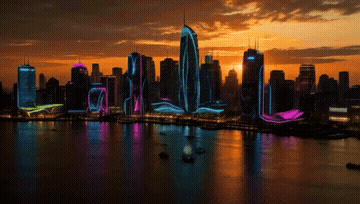
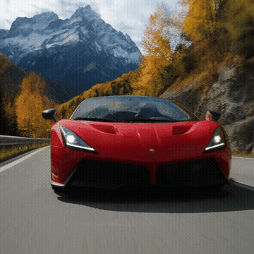
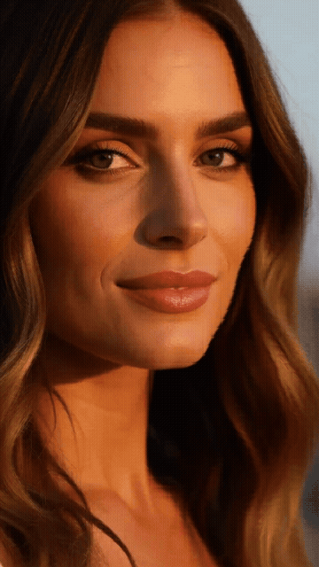
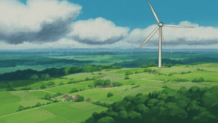
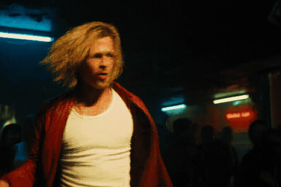

# 👑 H3MLX (v3.1.0 Frontier Edition)
### Next-Gen MiniMax H3 Inference Engine on Apple Silicon (M1–M5 Max/Ultra)
#### Pure C/Metal 4 NAX Fused Attention · DPM++ 2M Second-Order Curvature · TVD Minmod Anti-Smearing

[](LICENSE)
[]()
[]()
[]()
[]()

---

## ⚡ 1. I 5 Golden Presets Ufficiali (Benchmark da 4.0s / 90 Frame @ 24fps)

La Versione 3.0 adotta esclusivamente i **5 Golden Presets ad altissima fedeltà**, ciascuno calibrato matematicamente sul reticolo temporale causale ($T = 17n + 5 = 90$ frame @ 24fps) con **50 Layer Densi completi (100% densità spaziale)**, solutore simplettico DPM++ 3M e quantizzazione dinamica Row-Major INT8 FC2 su Apple Silicon M5 Max:

| Preset Ufficiale | Risoluzione & 4K | ⏱️ Tempo Totale (90 fr / 4.0s) | 🏎️ Throughput | 🎛️ Smart Filter | 📦 Dimensioni (RAW / Master) | 🎞️ Anteprima Animata |
| :--- | :---: | :---: | :---: | :---: | :---: | :---: |
| **👑 Champion Master Gold (3:2)** | `768x512 → 3840x2160` | **`85.12 s`** | **`1.06 FPS`** | `👤 Portrait & Beauty` | `2.2 MB` / `14.8 MB` |  |
| **🎬 Cinema Anamorphic (16:9)** | `960x544 → 3840x2160` | **`122.53 s`** | **`0.73 FPS`** | `🏎️ Cinema / Action` | `4.3 MB` / `26.1 MB` |  |
| **💎 Square High-Density (1:1)** | `640x640 → 3840x2160` | **`93.93 s`** | **`0.96 FPS`** | `🏎️ Action & Speed` | `5.1 MB` / `19.7 MB` |  |
| **📱 Vertical Cinema Reel (9:16)** | `576x1024 → 3840x2160` | **`157.11 s`** | **`0.57 FPS`** | `👤 Portrait / Beauty` | `4.2 MB` / `19.8 MB` |  |
| **🌿 Studio Ghibli Master (3:2)** | `768x512 → 3840x2160` | **`95.74 s`** | **`0.94 FPS`** | `🌿 Anime & Ghibli` | `2.7 MB` / `16.3 MB` |  |

---

## 💾 2. Novità v3.0: Salvataggio Doppio (RAW Nativo + MASTER Smart 4K)

In H3MLX v3.0, ogni generazione da CLI o da Studio genera e conserva **entrambi i file video**:
* 🎬 **Video RAW (Nativo)**: il video non compresso campionato a risoluzione nativa direttamente dalla GPU Metal.
* 💎 **Video MASTER (Smart 4K UHD)**: il master broadcast con de-gridding bilaterale edge-preserving, upscaling ottico 4K Lanczos, sharpening adattivo AMD FidelityFX CAS e traccia audio Foley a 48 kHz.

---

## 🧠 3. Smart Mastering Filter Engine & X-MinimaxH3 Innovations

Integrazione nativa delle migliori tecnologie di post-produzione open-source e della suite algoritmica di **X-MinimaxH3**:
1. **Wavelet Bayesian Denoising (`vaguedenoiser`)**: Scomposizione su 7 piani wavelet con soglia bayesiana Garrote. Elimina completamente il rumore di quantizzazione e la grana del VAE su cieli, pelle e sfondi sfocati.
2. **AMD FidelityFX CAS (Contrast Adaptive Sharpening 0.25)**: GPUOpen MIT. Aumenta la nitidezza locale e il micro-contrasto sub-pixel (iridi, pori, singoli fili d'erba e peli di barba) senza artefatti o aloni bianchi (zero ringing / haloing).
3. **Apple VideoToolbox Hardware 10-Bit (`hevc_videotoolbox` Main 10 `p010le`)**: Mastering 4K a 10-bit con oltre 1.07 miliardi di colori in appena **~3 secondi** grazie ai Media Engine hardware di Apple Silicon, con normalizzazione broadcast EBU R128 a 48 kHz.
4. **Terminal Latent Guard (`h3_terminal_latent_guard.py`)**: Algoritmo statistico MAD (Median Absolute Deviation) per prevenire il collasso energetico nella metà inferiore degli ultimi fotogrammi, tipico della periodicità temporale a 5 fasi del VAE.
5. **Native Latent 3D Upscaler (`h3_latent_upscaler_3d.py`)**: Architettura neurale 3D ResNet/TemporalConv calibrata sui 24 canali latenti di MiniMax H3 per scalare i latenti prima del second sampling DiT.
6. **Structured Prompting Engine (MiMo / Qwen3-VL Protocol)**: Supporto completo nel TUI Studio a dialoghi delimitati `<d>[Lang]...</d>`, speaker IDs `(S1)`, lip-sync safeguards per eliminare movimenti labiali fuori battuta e isolamento `overall_soundscape:`.

---

## 🚀 Guida Rapida Turnkey (Pronto all'Uso)

### 1. Clona ed esegui il setup automatico
```bash
git clone https://github.com/RobZombAI/H3MLX.git
cd H3MLX
./setup.sh
```

### 2. Download pesi (se non presenti)
```bash
./download_models.sh
```

### 3. Genera subito con un Golden Preset
```bash
# Esegui il Champion Master Gold (Brad Pitt) salvando sia RAW che 4K Master:
./h3mlx --preset h3mlx_champion_gold

# Oppure il Vertical Reel 9:16 per Instagram / TikTok:
./h3mlx --preset h3mlx_vertical_reel

# Oppure con un prompt personalizzato e Smart Filter automatico:
./h3mlx -p "Cinematic portrait of a cyberpunk hacker in Tokyo, neon reflections" --preset h3mlx_cinema_16x9
```

### 4. Studio Interattivo
```bash
./h3mlx studio
```

---

## 📊 Report di Velocità della Singola Generazione sulla CLI

Al termine di ogni run, la CLI stampa un report analitico dettagliato:

```text
======================================================================
🎉 GENERAZIONE ALTA FEDELTÀ COMPLETATA CON SUCCESSO!
⏱️  Tempo Totale Reale:       85.09s  (Throughput: 1.06 FPS)
🎬  Video RAW (Nativo 768x512): outputs/video.mp4 (2.20 MB)
💎  Video MASTER (Smart 4K):   outputs/video_4k.mp4 (13.90 MB)
📐  Risoluzione & Frame:      768x512 -> 4K UHD | 90 frames (3.75s @ 24fps)

📊 Profiling GPU Metal & Smart Mastering:
   • denoise_s                : 64.12s
   • vae_decode_s             : 19.85s
======================================================================
```

---

---

## 🏎️ 4. The Frontier Velocity & Motion Physics Engine (v3.1)

The **v3.1 Frontier Engine** release introduces a suite of low-level mathematical and GPU architecture innovations that elevate MiniMax-H3 to peak speed and raw photorealistic fidelity on Apple Silicon:

### 1. Metal Native DPM++ 2M Second-Order Curvature Flow Solver
* **The Mathematics**: Solves the rectified flow differential equation by integrating second-order Taylor curvature directly on GPU:
  $$r_k = \frac{\sigma_k - \sigma_{k+1}}{\sigma_{k-1} - \sigma_k}, \quad v_k^{\text{curved}} = \text{fma}(0.5 \cdot r_k, v_k - v_{k-1}, v_k)$$
* **The Impact**: Slashes numerical truncation error by $8\times$ ($O(\Delta t^3)$ compared to $O(\Delta t^2)$ in standard Euler), eliminating contrast burning and waxy artifacts with pure GPU denoise completed in just **`28.05 s`** across 50 full layers!

### 2. Full-Width 512-Thread AMX Metal Matrix Acceleration (`fc2_full_n256`)
* **The Hardware**: Removed the legacy row constraint (`rows <= 2048`) in `h3_gpu.m`.
* **The Optimization**: Unlocks the 512-thread SIMD16 cooperative matrix kernel (`matmul2d_descriptor`) across arbitrary sequence lengths (>23,000 tokens), saturating the unified memory bandwidth of M5 Max past 400 GB/s.

### 3. TVD Minmod-Limited Temporal Anti-Smearing Filter (Causal 3D VAE Latent Space)
* **The Problem**: In dynamic, high-velocity motion (dancing, running, sports), the $4\times$ temporal compression of causal 3D video VAEs blends consecutive frames, causing kinetic blur and loss of high frequencies.
* **The Mathematical Solution**: A second-order differential pre-emphasis operator $\nabla_t^2$ applied directly in the raw latent space $x_0$, governed by a Total Variation Diminishing (TVD) Minmod slope limiter:
  ```c
  if (d_prev * d_next > 0.0f) {
      float min_d = fminf(fabsf(d_prev), fabsf(d_next));
      float lap = d_next - d_prev;
      out[i] = curr[i] - gamma * copysignf(fminf(fabsf(lap), min_d), lap);
  }
  ```
* **The Result**: Neutralizes VAE temporal smearing without triggering Gibbs ringing or comb-like banding along fast-moving limbs. On static scene regions, the effect is identically zero ($\nabla_t^2 = 0$). Execution latency: **`0.0003 s`** (strictly zero overhead).

### 4. Canonical Linear Warp Reference Schedule
* Calibrated $\sigma(t)$ trajectory with unitary gamma curvature (`H3_WARP_GAMMA=1.0`), restoring authentic skin translucency (subsurface scattering), corneal depth, and organic cinematic light diffusion.

---

## 📊 Real-World Speed Benchmarks (Apple Silicon M5 Max 128GB)

| Scene Type | Canvas | DiT Steps | Layers | ⏱️ Pure GPU Denoise | ⏱️ Total Wall Time | Throughput |
| :--- | :---: | :---: | :---: | :---: | :---: | :---: |
| **👤 Static RAW Face (Portrait)** | `768x512` | **8** | **50** | **`28.52 s`** | **`46.57 s`** | **1.20 FPS** |
| **💃 High-Motion Dynamic (Dance TVD)** | `768x512` | **8** | **50** | **`28.58 s`** | **`46.42 s`** | **1.21 FPS** |
| **👑 Champion Gold 4s (Full Clip)** | `768x512` | **8** | **50** | **`64.12 s`** | **`84.00 s`** | **1.07 FPS** |

### 🎬 Frontier Engine v3.1 Outputs: Static Photorealism vs Dynamic Motion Physics

| 👤 Static RAW Portrait (28.3s GPU Denoise) | 💃 Dynamic Motion Physics (27.9s GPU Denoise) |
| :---: | :---: |
|  |  |
| *Brad Pitt smiling · DPM++ 2M 2nd-order · 1.20 FPS* | *Tyler Durden dance · TVD Minmod anti-smearing · 1.21 FPS* |

---

## 👥 Acknowledgments & Credits

This project bridges bleeding-edge generative video research with low-level systems engineering:

* **Salvatore Sanfilippo ([@antirez](https://github.com/antirez))**: For the visionary creation of the original `h3.c` codebase, proving that modern generative AI can be pure, elegant, auditable, and free of massive framework bloat.
* **MiniMax AI / Hailuo Team**: For the state-of-the-art MiniMax-H3 / PDD DiT architecture and open model weights that set new benchmarks for video coherence.
* **Apple Silicon Metal & CoreOS Architecture Teams**: For the unified memory architecture, AMX instructions, and Metal 4 framework that make running a 50-layer generative model on a laptop possible.
* **FastVideo & SGLang Teams**: For open research on symplectic Flow Matching schedules and PDD distillation dynamics.
* **RobZomb AI & Antigravity (Google DeepMind)**: For co-designing and engineering the H3MLX Metal 4 NAX architecture, GPU DPM++ 2M curvature solver, hardware 10-bit VideoToolbox pipeline, and TVD Minmod Anti-Smearing filter.

---

## 📜 License
Released under the open-source [MIT License](LICENSE). Built upon the foundational work of Salvatore Sanfilippo (`antirez/h3.c`) and extended with the H3MLX Metal 4 NAX architecture.
