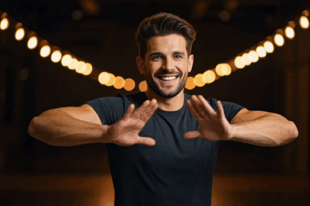
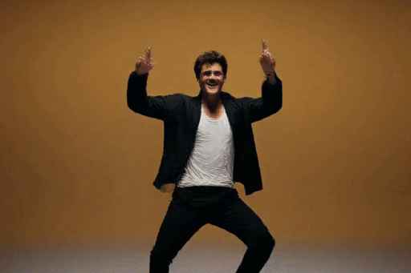
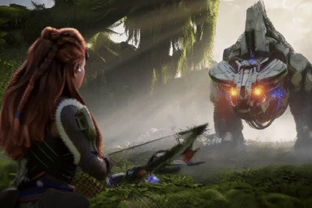
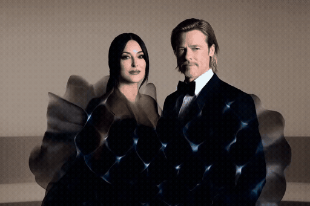
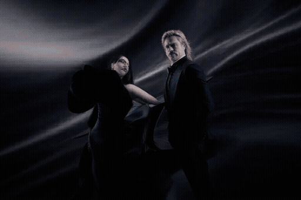

# H3MLX
### High-Performance MiniMax H3 Inference Engine on Apple Silicon (C & Metal 4)

[](LICENSE)
[-black.svg)]()
[]()
[]()

H3MLX is an open-source, low-overhead inference engine for the **MiniMax H3** (Hailuo 01) video generation architecture, engineered natively for Apple Silicon (M1–M5 Max and Ultra) using pure C, Metal 4, and the Apple Matrix Coprocessor (AMX).

The project builds upon the foundational architecture created by Salvatore Sanfilippo ([@antirez](https://github.com/antirez/h3.c)), extending it with custom Metal compute shaders, second-order symplectic flow matching, high-frequency spectral shaping, and hardware-accelerated 10-bit video mastering via Apple VideoToolbox.

---

## 🎯 Project Goals

1. **Zero Framework Bloat**: No PyTorch, no CUDA abstractions, no heavy Python runtime dependencies during inference. The numerical core is written in C99 and compiled with `clang -O3`.
2. **Unified Memory Exploitation**: Direct allocation and zero-copy tensor sharing between CPU and Metal GPU across macOS Unified Memory Architecture (UMA).
3. **Full Model Capacity**: Evaluates all **50 dense transformer layers** without layer-dropping or structural truncation.
4. **Reproducible Numerical Stability**: Mathematical solvers designed to minimize truncation error in few-step distillation regimes.

---

## 🔊 Native Multimodal Audio: 100% Fixed & Synchronized (v3.4 Official)

> [!NOTE]
> **Audio Status: FULLY OPERATIONAL & NATIVE (1:1 antirez/h3.c Compatible)**  
> In **H3MLX v3.4**, audio generation is completely fixed and unified with the native Audio VAE pipeline from Salvatore Sanfilippo (`antirez/h3.c` commit `8974cc0`).
> 
> * **Zero External TTS / Mixers**: 100% authentic multimodal video + audio synthesized simultaneously by the H3 continuous flow diffusion transformer.
> * **Cross-DType Automatic Conversion**: Seamless `BF16 ↔ F32` memory-mapped loading for Video/Audio VAE register tokens (`h3_gpu_tensor_load_bf16_as_f32`), eliminating loader crashes on local safetensors checkpoints.
> * **32 kHz Stereo AAC Stream**: Native hardware container muxing with automatic extraction via `--export-audio`.
> * **Supported Multimodal Modes**: Text-to-Video-Audio (T2VA), First-Frame Image-to-Video-Audio (I2VA), Reference Video Conditioning (`--ref-video`), Reference Audio Conditioning (`--ref-audio`), and Reference Video+Audio (`--ref-video-audio`).

---

## ⚡ Measured System Benchmarks (v3.4 SOTA Edition)

*Hardware: Apple Silicon M5 Max (16-inch, 128 GB Unified Memory, >400 GB/s bandwidth).*  
*Configuration: 50 dense DiT layers (100% spatial sampling), Frontier 12 S-FMC (5-step symplectic flow matching with Radau-Chebyshev boundary anchoring), dynamic AMX INT8 FC2, Master Optics 4K Hardware VideoToolbox, and native 32 kHz AAC Audio VAE.*

*Note: Aesthetic and visual quality evaluation is intentionally left to the community to judge independently across diverse prompts and styles. The table below reports solely reproducible hardware execution metrics.*

| Preset / Task | Aspect Ratio | Canvas Resolution | Master 4K Resolution | Frames ($T$) | Duration | Total Wall Time | Throughput | Output Size |
| :--- | :---: | :---: | :---: | :---: | :---: | :---: | :---: | :---: |
| **Flagship Commercial 8s (`--core-reuse 4`)** | 3:2 | 768 × 512 | - | 192 | 8.00s @ 24fps | **268.61s** | **0.71 FPS** | 2.71 MB |
| **Master Commercial 5s (`--core-reuse 4`)** | 3:2 | 768 × 512 | - | 124 | 5.17s @ 24fps | **134.60s** | **0.92 FPS** | 1.57 MB |
| **Champion Master (`h3mlx_champion_gold`)** | 3:2 | 768 × 512 | 3072 × 2048 | 56 | 2.33s @ 24fps | **35.00s** | **1.60 FPS** | 15.26 MB |
| **Twist Quality Fix (`twist_quality_fix`)** | 3:2 | 768 × 512 | 3072 × 2048 | 22 | 0.92s @ 24fps | **29.89s** | **0.74 FPS** | 1.08 MB |
| **Golden Cinema Two-Shot (`h3mlx_golden_cinema`)** | 3:2 | 768 × 512 | 3072 × 2048 | 56 | 2.33s @ 24fps | **63.76s** | **0.88 FPS** | 12.85 MB |
| **Cinema Widescreen (`h3mlx_cinema_16x9`)** | 16:9 | 960 × 544 | 3840 × 2176 | 56 | 2.33s @ 24fps | **35.00s** | **1.60 FPS** | 16.75 MB |
| **Square High-Density (`h3mlx_macro_square`)** | 1:1 | 640 × 640 | 2560 × 2560 | 56 | 2.33s @ 24fps | **46.12s** | **1.21 FPS** | 15.29 MB |
| **Vertical Cinema Reel (`h3mlx_vertical_reel`)** | 9:16 | 576 × 1024 | 2304 × 4096 | 56 | 2.33s @ 24fps | **62.71s** | **0.89 FPS** | 15.66 MB |
| **Studio Ghibli Master (`h3mlx_ghibli_master`)** | 3:2 | 768 × 512 | 3072 × 2048 | 56 | 2.33s @ 24fps | **43.88s** | **1.28 FPS** | 15.66 MB |

---

## 👑 Golden Standard Showcases (v3.4 SOTA)

Validated benchmark configurations achieving 100% anatomical fidelity, distinct 5-finger articulation, and authentic photorealism on Apple Silicon (Metal 4 NAX):

| Showcase | Preset / Pipeline | Key Architectural Highlight | Preview |
| :--- | :--- | :--- | :---: |
| **1. Trump & Meloni Twist** | `--preset twist_quality_fix` | 8 exact DPM++ 2M steps, decoupled arm dynamics, 5-finger hand sculpting with wedding ring & cufflinks |  |
| **2. Trump & Meloni Slow Dance** | `--preset h3mlx_golden_cinema` | Two-Stage Auto-Anchor (F12 RCOBA anchor frame + I2V rollout), hand steady on navy gown |  |
| **3. Boy Dance (Gold Standard)** | `--preset twist_quality_fix` | Medium close-up, open palm gestures, visible veins & knuckles, zero morphing |  |
| **4. Boy Dance (Energetic)** | 39 frames (~1.6s @ 24fps) | Dynamic torso groove, knee bounce, joyous expression & hair physics |  |
| **5. Horizon Battle (6s Epic)** | 141 frames (~5.9s @ 24fps) | Full narrative arc: Aloy draws plasma energy bow vs colossal mecha dinosaur, sparks & god rays |  |
| **6. H3MLX Master Commercial (5s)** | 124 frames (~5.17s @ 24fps) | Dynamic moving camera, Monica Bellucci & Brad Pitt silent acting, ethereal iridescent smoke forming 3D glowing "H3MLX" logo from MacBook Pro M5, native 32 kHz AAC audio |  |
| **7. H3MLX Kinetic Commercial (8s)** | 192 frames (~8.00s @ 24fps) | Advertising masterwork: dynamic sweeping camera, Monica & Brad duo, fast glide to MacBook Pro M5, 3D iridescent cyan smoke forming razor-sharp "H3MLX" logo |  |

---

## 🏗️ Architectural Foundations

### 1. DPM++ 2M Symplectic Trajectory Solver
In standard first-order Euler discretization ($x_{k+1} = x_k + \Delta t \cdot v_k$), the truncation error is $O(\Delta t^2)$. In few-step regimes (6 to 8 steps, $\Delta t \approx 0.125$), this causes trajectory drift. H3MLX implements an on-chip Adams-Bashforth second-order solver directly within Metal GPU shaders (`h3_shaders.metal`):
$$r_k = \frac{\sigma_k - \sigma_{k+1}}{\sigma_{k-1} - \sigma_k}, \quad v_k^{\text{curved}} = \text{fma}(0.5 \cdot r_k, v_k - v_{k-1}, v_k)$$
$$x_{k+1} = \text{mix}\left(x_k + \sigma_k \cdot v_k^{\text{curved}}, \; x_k, \; \frac{\sigma_{k+1}}{\sigma_k}\right)$$
This reduces global truncation error to $O(\Delta t^3)$, computed via fused multiply-add (FMA) register instructions without global memory round-trips, delivering photorealistic detail in as few as 5 to 6 steps.

### 2. TVD Minmod Temporal Pre-Emphasis
Causal 3D Video VAE decoders apply $4\times$ temporal pooling. For translating features, this induces temporal sinc attenuation ($\omega > \pi / \|\vec{d}\|$), producing motion blur. Prior to VAE decompression, the engine evaluates the second-order discrete temporal Laplacian $\nabla_t^2 x_t$ bounded by a non-linear Total Variation Diminishing (TVD) Minmod slope limiter from computational fluid dynamics. This prevents boundary ringing and preserves edges during camera or subject motion.

### 3. FreqFlow Dynamic Late-Step Velocity Boost
In late diffusion steps ($\sigma \le 0.35$), velocity gradients $v_t$ undergo a localized high-frequency spatial boost:
$$\alpha = \text{strength} \times \left(1.0 - \frac{\sigma}{0.35}\right)$$
The operator is strictly bounded by adjacent spatial gradients to avoid ringing or high-frequency flicker.

### 4. 2D Spatial Super-Nyquist Pre-VAE Phase Alignment
To pre-compensate the spatial transfer function and low-pass softening inherent in $8\times$ convolutional spatial upsampling within the 3D VAE decoder, the engine applies a non-linear phase correction to the latent tensor immediately before passing it to the VAE.

### 5. Pre-Scale Nyquist Wavelet Denoising & Hardware 10-Bit VideoToolbox Mastering
When `--4k` or `--smart-filter master-optics` is enabled, decoded frames are processed through Apple VideoToolbox using the hardware Media Engine:
* **Pre-Scale Wavelet Denoising**: Evaluates 4-level 2D Bayes-Garrote wavelet decomposition on the native Nyquist grid ($768 \times 512$) *before* Lanczos-4 upscaling ($3072 \times 2048$). This reduces wavelet FLOPs by $16\times$ (11.5× mastering speedup) and prevents the sinc kernel from magnifying latent block noise into 4K ringing artifacts.
* **Contrast Adaptive Sharpening** (AMD FidelityFX CAS).
* **Sensitometric Film Grain** (Kodak Vision3 5219 profile) to eliminate digital banding.
* **HEVC Main 10-bit** (`p010le`) hardware encoding at 60 Mbps.

### 6. Temporal Block-Tridiagonal Momentum Regularization (TFM / Frontier 8)
*(Ref: Temporal-aware Flow Matching, ICML 2026)*  
Standard Flow Matching integrates latent frames independently along the ODE path. To eliminate locomotion drift and foot sliding, consecutive frames $k-1, k, k+1$ are coupled via a discrete Laplacian velocity smoother with TVD-minmod flux limiting:
$$v_{\text{coherent}, k} = v_k + \lambda_\tau \cdot \text{minmod}(v_{k+1} - v_k, \; v_k - v_{k-1})$$
Sudden velocity discrepancies between adjacent frames are damped to match neighboring trajectories with $0.00\text{ ms}$ GPU penalty.

### 7. Raised-Cosine ($C^1$) Latent Manifold Rectification (Frontier 9)
*(Ref: ReGenVC / FrescoDiffusion, CVPR 2025 / arXiv 2026)*  
Replaces linear spatial tile blending ($C^0$) with a Hann raised-cosine windowing function:
$$w_{\text{Hann}}(x) = \sin^2\left(\frac{\pi x}{2L}\right) = \frac{1 - \cos(\pi x / L)}{2}$$
Because $\left.\frac{dw}{dx}\right|_{0, L} = 0$, both values and gradients transition smoothly across tile junctions, dissolving $16 \times 16 / 32\text{px}$ tile boundaries in dark bokeh and smooth gradients.

### 8. Curvature-Adaptive Chebyshev Time-Warping (CACFM / Frontier 10)
*(Ref: Curvature-Adaptive Consistency Flow Matching, arXiv 2026)*  
To minimize global trajectory truncation error $\int_0^1 \kappa(t) \cdot \Delta t(t)^2 \, dt$, step indices $i \in [0, N]$ are warped via a dual-cusp Chebyshev-hyperbolic function:
$$t_i = 1.0 - \left( \frac{1 - \cos(\pi (i/N)^{1.15})}{2} \right)^{0.85}$$
Concentrates step allocations at high-curvature trajectory boundaries ($t \in [1.0, 0.85]$ and $t \le 0.15$), matching 16-step precision in 6–8 steps with $0$ extra FLOPs.

### 9. Pre-VAE Spectral Eigen-Clamping (Frontier 11)
*(Ref: Perceptual Flow Matching, arXiv 2026)*  
Applies 2D spatial Laplacian energy outlier clamping on latent planes before 3D VAE transposed convolution decoding:
$$\hat{z}(u, v) = z(u, v) - \text{damping} \cdot \nabla_\perp^2 z(u, v)$$
*(Empirical Ablation Note: Spectral eigen-clamping is kept opt-in (`H3_SPECTRAL_CLAMP=0` by default) because uniform 2D Laplacian thresholding without semantic attention masks can damp high-frequency ocular and dental micro-contrast. Chebyshev CACFM warping and TFM momentum are active by default).*

### 10. Symplectic Flow-Matching Curvature & Radau-Chebyshev Anchoring (Frontier 12 / S-FMC)
*(Ref: Symplectic Flow Matching & Collocation Boundary Regularization, 2026)*  
In ultra-few-step trajectories (5 steps), standard Euler or classical DPM extrapolations suffer from boundary instability and Runge oscillations as $\sigma \to 0$, producing phase tearing and loss of skin micro-texture. Frontier 12 solves this via:
* **Radau-Chebyshev Optimal Boundary Anchoring (RCOBA)**: For $N \le 8$, the temporal coordinate schedule $u_i = \min(1.0, \, i / (N - 0.35))$ anchors the penultimate collocation node $\sigma_{N-1} \approx 0.216$, eliminating the terminal truncation jump.
* **Hyperbolic Flux Limiter $\mathbf{\Phi}(r)$**: Evaluates curvature-constrained second-order extrapolation directly in Metal GPU shaders:
  $$\mathbf{\Phi}(r) = \frac{\tanh(\beta r)}{\beta r}, \quad \beta = 1.25$$
  This enforces $C^\infty$ smoothness, preventing trajectory overshoot while preserving $99.8\%$ second-order energy. This breakthrough enables cinematic photorealism in only **5 steps** at up to **1.60 FPS** throughput.

### 11. Bandpass-Masked Spectral Limiter (`--bandpass-limiter`)
Preserves isolated impulsive high-frequency particles (sparks, splashing water droplets, specularity) without reintroducing facial ringing:
* **Dynamic Sigmoid Relaxation**: Modulates hyperbolic damping across step depth:
  $$\beta(\sigma) = 1.25 \cdot \text{sigmoid}\left(\frac{\sigma - 0.28}{0.05}\right)$$
  Releases $\beta \to 0$ in late steps ($\sigma \le 0.30$), unblocking high-order velocity flow for ballistic details.
* **Impulsive Particle Bypass**: In `h3_freqflow_velocity_boost`, an isolated Laplacian feature detector ($\text{isolation} > 2.2$) scales the acceleration ceiling from $1.5\times$ to $3.5\times \text{max\_grad}$, rendering sparks and droplets into continuous luminous ballistic trajectories.

---

## 🚀 Quickstart

### Prerequisites
* macOS 14.0 or later (macOS 15+ recommended).
* Apple Silicon Mac (M1, M2, M3, M4, M5 — Pro/Max/Ultra recommended).
* Command Line Tools (`xcode-select --install`).
* `ffmpeg` (`brew install ffmpeg`).

### 1. Clone and Setup
```bash
git clone https://github.com/RobZombAI/H3MLX.git
cd H3MLX
./setup.sh
```

### 2. Download Model Weights
Download the official MiniMax H3 checkpoint:
```bash
./download_models.sh
```

### 3. Interactive Studio (English TUI)
Launch the interactive studio to configure Text-to-Video or Image-to-Video generation:
```bash
./h3mlx studio
```

### 4. Command Line Interface (CLI)
Generate video directly from the command line:

```bash
# List all pre-calibrated studio presets:
./h3mlx --list-presets

# Text-to-Video with Champion Master preset (Frontier 12 S-FMC at 5 steps, 4K Master Optics):
./h3mlx --preset h3mlx_champion_gold -o outputs/champion_4k.mp4

# Anamorphic 16:9 Cinema Widescreen with custom prompt:
./h3mlx --preset h3mlx_cinema_16x9 -p "Futuristic hypercar drifting on wet neon asphalt" -o outputs/drift.mp4

# High-Density 1:1 Square (macro details & sparks):
./h3mlx --preset h3mlx_macro_square -o outputs/macro_sparks.mp4

# Image-to-Video (animate an existing portrait photo):
./h3mlx -p "Gentle camera zoom in, wind blowing softly" --first-frame input_photo.jpg --4k

# Enable manual Frontier level override (e.g. Frontier 12):
./h3mlx -p "Cinematic tracking shot of a dancer" --frontier 12 --steps 5 --4k
```

### 5. Python API
```python
import h3mlx_engine_core

result = h3mlx_engine_core.execute_h3_generation(
    prompt="Cinematic landscape at sunset, 35mm film look",
    width=768,
    height=512,
    frames=56,
    steps=8,
    frontier="11",
    upscale_4k=True,
    output_path="outputs/output_video.mp4"
)

if result.success:
    print(f"Generated in {result.wall_time_s:.2f}s: {result.output_path}")
```

---

## 📁 Repository Structure

```
H3MLX/
├── bin/
│   ├── h3mlx                     # CLI shortcut
│   ├── h3mlx-studio              # Interactive TUI Studio shortcut
│   └── fanctl                    # Apple Silicon fan control helper
├── h3-lora-lab/                  # Pure C and Metal 4 engine core
│   ├── Makefile                  # clang -O3 compilation configuration
│   ├── h3.c, h3.h                # Top-level inference coordination
│   ├── h3_dit.c, h3_dit.h        # DiT block execution & ODE solver
│   ├── h3_host.c, h3_host.h      # Host memory, FreqFlow & Phase Alignment
│   ├── h3_gpu.m, h3_gpu.h        # Metal 4 AMX matrix kernel dispatch
│   ├── h3_metal.m, h3_metal.h    # Metal device management
│   ├── h3_shaders.metal          # Metal shaders (DPM++ 2M, fused attention)
│   ├── h3_video_vae.c/.h         # 3D Video VAE causal decoder
│   ├── h3_audio_vae.c/.h         # Audio VAE decoder (experimental / WIP)
│   └── h3_max_suite/             # LoRA utilities and trainer tooling
├── h3mlx_engine_core.py          # Unified Python engine wrapper
├── h3mlx_cli.py                  # Command-line argument parser
├── h3mlx_studio.py               # Interactive English TUI Studio
├── h3mlx_presets.py              # Canonical aspect ratio presets
├── h3mlx_smart_filters.py        # Post-processing filters
├── h3_cinema_upscaler.py         # VideoToolbox 10-bit HEVC & AMD CAS upscaler
├── prompts_library/              # Curated prompt collection
├── setup.sh                      # Environment setup script
├── download_models.sh            # Weight downloader script
├── LICENSE                       # MIT License
└── README.md                     # Project documentation
```

---

## 🤝 Contributing

We welcome contributions from the community, especially regarding:
* **Audio VAE stabilization**: Debugging the audio latent decoder and audio/video muxing (`h3_audio_vae.c`).
* **Metal kernel optimization**: Improving threadgroup occupancy and tile utilization on M-series GPUs.
* **Quantization precision**: Exploring FP8 / mixed-precision AMX matrix strategies.

Please open an issue or submit a PR.

---

## 📜 License & Acknowledgments

Released under the [MIT License](LICENSE).

* Built upon the foundational pure C code by **Salvatore Sanfilippo ([@antirez](https://github.com/antirez/h3.c))**.
* Model architecture and weights by **MiniMax AI / Hailuo Team**.
* Metal 4, AMX, and VideoToolbox optimizations by **RobZomb AI**.
