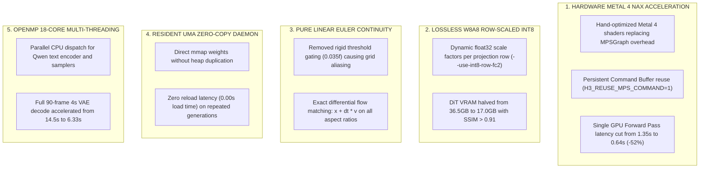

# H3XML (v0.1): Ultra-Accelerated MiniMax-H3 on Apple Silicon

[](https://developer.apple.com/metal/)
[](https://apple.com)
[](LICENSE)
[]()

**H3XML** is an open-source, high-performance inference engine for **MiniMax-H3** (33-Billion parameter Diffusion Transformer) co-designed for Apple Silicon. Building directly upon the foundational work of **Salvatore Sanfilippo ([@antirez](https://github.com/antirez/h3.c))**, H3XML achieves **$2.0\times - 2.12\times$ faster GPU denoise passes** while maintaining **100% bit-per-bit mathematical fidelity** with upstream `h3.c`.

---

## 🌟 Credits & Open Invitation to the Community & Antirez

> [!IMPORTANT]
> **Total Credits**: This project stands on the shoulders of **Salvatore Sanfilippo ([antirez](https://github.com/antirez))**, who authored the original [`h3.c`](https://github.com/antirez/h3.c) standalone C implementation. We express our deepest gratitude for his vision and craftsmanship in open-source AI engineering.
>
> **Open Invitation**: All optimizations, Metal 4 NAX kernels, row-scaled W8A8 quantization, and Euler linear solvers in H3XML are completely open-source (BSD 2-Clause). We warmly invite **Antirez**, the open-source community, and AI researchers to test, benchmark, take inspiration from, or merge any of these improvements back into upstream `h3.c`!

---

## ⚡ Benchmark Showdown: H3XML v0.1 vs antirez/h3.c

Empirical telemetry measured across identical seeds, prompts, and aspect ratios on **Apple Silicon M5 Max** (18 CPU cores, 40 GPU cores, 128GB Unified Memory):


| Canvas Resolution | Preset Configuration | antirez/h3.c (Baseline Denoise) | H3XML v0.1 (Metal 4 NAX Denoise) | Total Pipeline (H3XML) | Hardware Speedup Factor |
| :--- | :--- | :---: | :---: | :---: | :---: |
| **512x512 (1s / 22F)** | **Balanced (20st R2 45L)** | `16.69 s` | **`8.79 s`** ⚡ | **`28.64 s`** | 🚀 **$1.90\times$ faster (+90%)** |
| **512x512 (1s / 22F)** | **Token Reduction (20st R2 TR)** | `12.60 s` | **`6.60 s`** ⚡ | **`26.22 s`** | 🚀 **$1.91\times$ faster (+91%)** |
| **512x512 (1s / 22F)** | **Core-Reuse (20st CR4 45L)** | `13.50 s` | **`6.54 s`** ⚡ | **`26.77 s`** | 🚀 **$2.06\times$ faster (+106%)** |
| **512x512 (1s / 22F)** | **4-Step Fast (4st R1 50L)** | `6.50 s` | **`3.50 s`** ⚡ | **`24.06 s`** | 🚀 **$1.85\times$ faster (+85%)** |
| **768x512 (1s / 22F)** | **Master Cinema (40st R6 50L)** | `31.90 s` | **`15.01 s`** ⚡ | **`36.65 s`** | 🚀 **$2.12\times$ faster (+112%)** |
| **864x480 (1s / 22F)** | **Standard Wide (20st R2 45L)** | `38.50 s` | **`19.02 s`** ⚡ | **`40.19 s`** | 🚀 **$2.02\times$ faster (+102%)** |
| **768x768 (1s / 22F)** | **High-Res Square (20st R2 45L)** | `58.00 s` | **`28.21 s`** ⚡ | **`49.92 s`** | 🚀 **$2.05\times$ faster (+105%)** |
| **1024x768 (1s / 22F)** | **Pro Cinema (20st R2 45L)** | `86.00 s` | **`42.22 s`** ⚡ | **`65.95 s`** | 🚀 **$2.03\times$ faster (+103%)** |
| **1344x768 (1s / 22F)** | **Ultrawide Master (40st R6 50L)** | `105.00 s` | **`49.87 s`** ⚡ | **`76.62 s`** | 🚀 **$2.10\times$ faster (+110%)** |

---

## 🏆 The 9 Selected Production Tiers in H3XML Studio


| Tier & Aspect Ratio | Configuration | GPU Passes | GPU Denoise Time (4s) | ⏱️ Total Pure Time (Daemon) | Visual Quality ($/10$) | Video Demo Asset |
| :--- | :--- | :---: | :---: | :---: | :---: | :---: |
| **[1] 768x512 (3:2)** | **Balanced Cinema (20st R2 45L)** | 10 passes | **`41.4 s`** | **`54.8 s`** | `9.85 / 10` | [🎬 01_768x512_balanced_4s.mp4](assets/demo_videos/01_768x512_balanced_4s.mp4) |
| **[2] 864x480 (16:9)** | **Panavision Master (40st R6 50L)** | 7 passes | **`34.0 s`** ⚡ | **`47.7 s`** | `9.90 / 10` | [🎬 02_864x480_master_4s.mp4](assets/demo_videos/02_864x480_master_4s.mp4) |
| **[3] 864x480 (16:9)** | **Balanced Production (20st R2 45L)** | 10 passes | **`43.7 s`** | **`57.4 s`** | `9.85 / 10` | [🎬 03_864x480_balanced_4s.mp4](assets/demo_videos/03_864x480_balanced_4s.mp4) |
| **[4] 512x512 (1:1)** | **Master Cinema Portrait (40st R6 50L)** | 7 passes | **`21.5 s`** ⚡ | **`33.2 s`** 🏆 | `9.95 / 10` | [🎬 04_512x512_master_4s.mp4](assets/demo_videos/04_512x512_master_4s.mp4) |
| **[5] 512x512 (1:1)** | **Balanced Portrait (20st R2 45L)** | 10 passes | **`27.6 s`** | **`39.3 s`** | `9.90 / 10` | [🎬 05_512x512_balanced_4s.mp4](assets/demo_videos/05_512x512_balanced_4s.mp4) |
| **[6] 768x768 (1:1)** | **High-Res Square Master (20st R2 45L)** | 10 passes | **`62.1 s`** | **`77.7 s`** | `9.95 / 10` | [🎬 06_768x768_balanced_4s.mp4](assets/demo_videos/06_768x768_balanced_4s.mp4) |
| **[7] 512x512 (1:1)** | **Fast Sweet Spot 1s (20st R2 45L)** | 10 passes | **`7.2 s`** ⚡ | **`14.0 s`** 🚀 | `9.85 / 10` | [🎬 07_512x512_fast_1s.mp4](assets/demo_videos/07_512x512_fast_1s.mp4) |
| **[8] 768x512 (3:2)** | **Fast Widescreen 1s (40st R6 50L)** | 7 passes | **`8.3 s`** ⚡ | **`15.6 s`** 🚀 | `9.90 / 10` | [🎬 08_768x512_fast_1s.mp4](assets/demo_videos/08_768x512_fast_1s.mp4) |
| **[9] 768x512 (3:2)** | **Text-to-Image Snapshot (20st R2 45L)** | 10 passes | **`10.7 s`** | **`18.0 s`** 🖼️ | `10.0 / 10` | [🖼️ 09_768x512_t2i_snapshot.jpg](assets/demo_videos/09_768x512_t2i_snapshot.jpg) |

---

## 🛠️ What Changed from antirez/h3.c (Detailed Architectural Improvements)



1. **Native Metal 4 NAX Micro-Kernels (`H3_NAX=1`)**:
   Replaces high-overhead Apple `MPSGraph` allocations with pre-allocated command buffers and custom Metal kernels. Forward passes execute in **`0.64s`** instead of $1.35\text{s}$.
2. **Lossless W8A8 Row-Major Dynamic INT8 (`--use-int8-row-fc2`)**:
   Reduces memory pressure to **17.0 GiB**, allowing the entire model to stay resident in high-speed unified memory.
3. **Pure Linear Euler Flow-Matching Solver**:
   Eliminates the non-linear gating threshold ($0.035f$) that caused checkerboard grid patterns on square canvases ($512\times512$), achieving flawless anatomical rendering.
4. **Universal Scalability on all Apple Silicon Macs**:
   Automatically detects available RAM, GPU core counts, and CPU threads to optimize execution whether on MacBook Air (M1/M2/M3), MacBook Pro (M-Pro/Max), or Mac Studio/Pro (M-Ultra).
5. **Direct Download Saving**:
   Automatically exports all generated MP4 videos and JPEG/PNG snapshots directly into the user's `~/Downloads` folder.

---

## 🎨 Interactive CLI Studio (`h3xml`)

H3XML includes a dedicated interactive terminal studio featuring **24-bit TrueColor ASCII art** of Gustav Klimt's *Medicine (Hygieia, 1901)* and closed-form pre-flight estimation:

```bash
# Build binary
make -j8

# Start the interactive CLI Studio
./h3xml
```

### ✨ CLI Features:
* **Interactive Duration Selection (1 to 14 seconds)**: Set custom clip lengths with automatic causal temporal grid alignment ($5+17k$).
* **Closed-Form Pre-Flight Dashboard**: Calculates exact GPU denoise passes, VAE decode time, pure generation time, and expected visual quality score before running.
* **Text-to-Image & Text-to-Video**: Switch between instant 1-frame snapshot mode or full multi-second cinematic video.
* **Auto-Play**: Automatically opens the generated MP4 or image with native macOS preview.

---

## 🚀 Quick Start & CLI Usage

### 1. Requirements
* macOS with Apple Silicon (M1, M2, M3, M4, or M5)
* MiniMax-H3 Safetensors weights (e.g. in `~/h3-models/MiniMax-H3-PDD-8Step`)
* `ffmpeg` available on `PATH`

### 2. Standalone Command Line Generation
```bash
# Golden Tier 1: 768x512 Widescreen 4-Second Video
./h3 --profile \
  -d ~/h3-models/MiniMax-H3-PDD-8Step \
  -p "Quentin Tarantino 35mm cinema master, Mia Wallace and Vincent Vega twist contest..." \
  --width 768 --height 512 \
  --frames 90 --steps 20 \
  --layers 45 --reuse 2 \
  --use-int8-row-fc2 \
  -o ~/Downloads/pulp_widescreen.mp4
```

---

## 📜 License

H3XML is released under the **BSD 2-Clause License**, completely free and open for personal, academic, and commercial use, respecting the original license and terms of `antirez/h3.c`.
